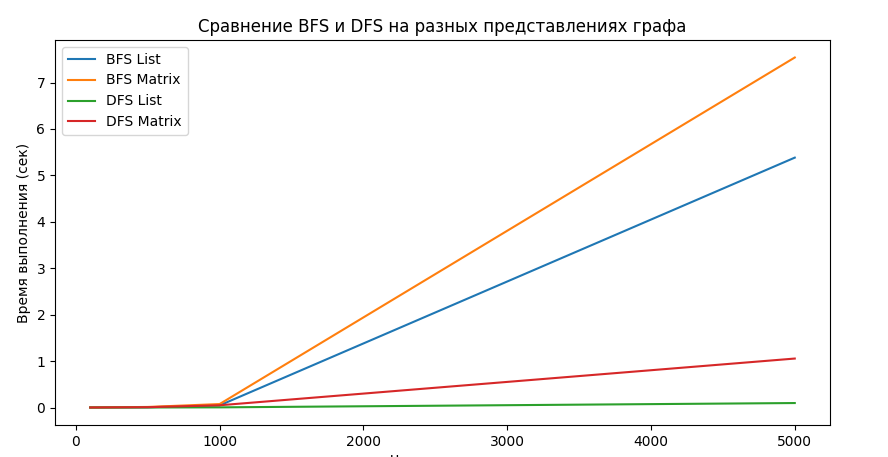

# Отчет по лабораторной работе 10
# Графы

**Дата:** 2025-10-06
**Семестр:** 3 курс 1 полугодие - 5 семестр
**Группа:** ПИЖ-Б_О-23-1(2)
**Дисциплина:** Анализ сложности алгоритмов
**Студент:** Проценко Дмитрий Максимович

## Цель работы
Изучить основные понятия теории графов и алгоритмы работы с ними. Освоить
представления графов в памяти и основные алгоритмы обхода. Получить практические навыки
реализации алгоритмов на графах и анализа их сложности.

## Теоретическая часть

- Граф: Множество вершин (узлов) и рёбер (связей) между ними. Виды: ориентированные/неориентированные, взвешенные/невзвешенные.
- Представление графов:
    - Матрица смежности: O(V²) памяти, быстрая проверка ребра
    - Список смежности: O(V + E) памяти, эффективный обход соседей
- Обход графов:
    - Поиск в ширину (BFS): находит кратчайшие пути в невзвешенном графе, сложность O(V + E)
    - Поиск в глубину (DFS): обход с возвратом, сложность O(V + E)
- Алгоритмы на графах:
    - Топологическая сортировка: для ориентированных ациклических графов (DAG)
    - Поиск компонент связности
    - Алгоритм Дейкстры: кратчайшие пути во взвешенном графе с неотрицательными весами

Для проведения тестов использовался апарат со следующими комплектующими:
Характеристики ПК для тестирования:
- Процессор: Intel Core i7-12700H @ 2.30GHz
- Оперативная память: 16 GB DDR4
- ОС: Windows 11
- Python: 3.13.1

## Практическая часть

1. Реализовать различные представления графов (матрица смежности, список смежности).
2. Реализовать алгоритмы обхода графов (BFS, DFS).
3. Реализовать алгоритмы поиска кратчайших путей и компонент связности.
4. Провести сравнительный анализ эффективности разных представлений графов.
5. Решить практические задачи на графах.

### Ключевые фрагменты кода

~~~ python
from collections import defaultdict

class AdjacencyMatrixGraph:
    def __init__(self, num_vertices):
        """
        Инициализация графа с num_vertices вершинами.
        Память: O(V^2)
        """
        self.num_vertices = num_vertices
        self.matrix = [[0] * num_vertices for _ in range(num_vertices)]

    def add_edge(self, u, v, weight=1):
        """
        Добавление ребра (u -> v)
        Время: O(1)
        """
        self.matrix[u][v] = weight

    def remove_edge(self, u, v):
        """
        Удаление ребра (u -> v)
        Время: O(1)
        """
        self.matrix[u][v] = 0

    def add_vertex(self):
        """
        Добавление новой вершины
        Время: O(V^2) (надо расширить все строки)
        Память: увеличивается на O(V)
        """
        self.num_vertices += 1
        for row in self.matrix:
            row.append(0)
        self.matrix.append([0] * self.num_vertices)

    def remove_vertex(self, v):
        """
        Удаление вершины v
        Время: O(V^2) (надо удалить строку и столбец)
        """
        self.matrix.pop(v)
        for row in self.matrix:
            row.pop(v)
        self.num_vertices -= 1

from collections import defaultdict

class AdjacencyMatrixGraph:
    def __init__(self, num_vertices):
        """
        Инициализация графа с num_vertices вершинами.
        Память: O(V^2)
        """
        self.num_vertices = num_vertices
        self.matrix = [[0] * num_vertices for _ in range(num_vertices)]

    def add_edge(self, u, v, weight=1):
        """
        Добавление ребра (u -> v)
        Время: O(1)
        """
        self.matrix[u][v] = weight

    def remove_edge(self, u, v):
        """
        Удаление ребра (u -> v)
        Время: O(1)
        """
        self.matrix[u][v] = 0

    def add_vertex(self):
        """
        Добавление новой вершины
        Время: O(V^2) (надо расширить все строки)
        Память: увеличивается на O(V)
        """
        self.num_vertices += 1
        for row in self.matrix:
            row.append(0)
        self.matrix.append([0] * self.num_vertices)

    def remove_vertex(self, v):
        """
        Удаление вершины v
        Время: O(V^2) (надо удалить строку и столбец)
        """
        self.matrix.pop(v)
        for row in self.matrix:
            row.pop(v)
        self.num_vertices -= 1

class AdjacencyListGraph:
    def __init__(self):
        """
        Словарь: ключ = вершина, значение = список соседей с весами
        Память: O(V + E)
        """
        self.graph = defaultdict(list)

    def add_edge(self, u, v, weight=1):
        """
        Добавление ребра (u -> v)
        Время: O(1)
        """
        self.graph[u].append((v, weight))

    def remove_edge(self, u, v):
        """
        Удаление ребра (u -> v)
        Время: O(deg(u))
        """
        self.graph[u] = [pair for pair in self.graph[u] if pair[0] != v]

    def add_vertex(self, v):
        """
        Добавление вершины
        Время: O(1)
        """
        self.graph[v] = []

    def remove_vertex(self, v):
        """
        Удаление вершины и всех входящих рёбер
        Время: O(V + E)
        """
        self.graph.pop(v, None)
        for u in self.graph:
            self.graph[u] = [pair for pair in self.graph[u] if pair[0] != v]

from collections import deque

def bfs(graph, start):
    """
    Breadth-First Search
    Возвращает: расстояния и родительские вершины
    Время: O(V + E)
    Память: O(V)
    """
    visited = set()
    queue = deque([start])
    distances = {start: 0}
    parents = {start: None}

    while queue:
        u = queue.popleft()
        visited.add(u)
        for v, _ in graph.graph.get(u, []):
            if v not in visited and v not in queue:
                queue.append(v)
                distances[v] = distances[u] + 1
                parents[v] = u
    return distances, parents

def dfs_recursive(graph, start, visited=None):
    """
    Depth-First Search рекурсивный
    Время: O(V + E)
    Память: O(V) для стека рекурсии
    """
    if visited is None:
        visited = set()
    visited.add(start)
    for v, _ in graph.graph.get(start, []):
        if v not in visited:
            dfs_recursive(graph, v, visited)
    return visited

def dfs_iterative(graph, start):
    """
    Depth-First Search итеративный через стек
    Время: O(V + E)
    Память: O(V)
    """
    visited = set()
    stack = [start]

    while stack:
        u = stack.pop()
        if u not in visited:
            visited.add(u)
            for v, _ in graph.graph.get(u, []):
                if v not in visited:
                    stack.append(v)
    return visited

import heapq
from graph_traversal import dfs_recursive

def connected_components(graph):
    """
    Находит компоненты связности
    Время: O(V + E)
    Память: O(V)
    """
    visited = set()
    components = []

    for vertex in graph.graph:
        if vertex not in visited:
            component = dfs_recursive(graph, vertex)
            components.append(component)
            visited.update(component)
    return components

def topological_sort(graph):
    """
    Топологическая сортировка DAG
    Время: O(V + E)
    Память: O(V)
    """
    visited = set()
    stack = []

    def dfs(u):
        visited.add(u)
        for v, _ in graph.graph.get(u, []):
            if v not in visited:
                dfs(v)
        stack.append(u)

    for vertex in graph.graph:
        if vertex not in visited:
            dfs(vertex)

    return stack[::-1]

def dijkstra(graph, start):
    """
    Находит кратчайшие пути из start
    Время: O((V + E) log V) с кучей
    Память: O(V)
    """
    distances = {v: float('inf') for v in graph.graph}
    distances[start] = 0
    pq = [(0, start)]
    parents = {start: None}

    while pq:
        current_distance, u = heapq.heappop(pq)
        if current_distance > distances[u]:
            continue
        for v, weight in graph.graph.get(u, []):
            distance = current_distance + weight
            if distance < distances[v]:
                distances[v] = distance
                parents[v] = u
                heapq.heappush(pq, (distance, v))
    return distances, parents

import time
import random
import matplotlib.pyplot as plt
import networkx as nx
from graph_representation import AdjacencyMatrixGraph, AdjacencyListGraph
from graph_traversal import bfs, dfs_iterative

def generate_random_graph(num_vertices, edge_prob=0.1, weighted=False):
    g_matrix = AdjacencyMatrixGraph(num_vertices)
    g_list = AdjacencyListGraph()
    for v in range(num_vertices):
        g_list.add_vertex(v)

    for u in range(num_vertices):
        for v in range(num_vertices):
            if u != v and random.random() < edge_prob:
                weight = random.randint(1, 10) if weighted else 1
                g_matrix.add_edge(u, v, weight)
                g_list.add_edge(u, v, weight)
    return g_matrix, g_list

def measure_operations():
    sizes = [100, 500, 1000, 5000]  # для примера, можно увеличить
    bfs_times_matrix, bfs_times_list = [], []
    dfs_times_matrix, dfs_times_list = [], []

    print("=== Замеры времени BFS и DFS ===")
    print(f"{'Vertices':>8} | {'BFS List':>10} | {'BFS Matrix':>10} | {'DFS List':>10} | {'DFS Matrix':>10}")
    print("-"*60)

    for n in sizes:
        g_matrix, g_list = generate_random_graph(n, edge_prob=0.05)
        start = 0

        # BFS на списке
        t0 = time.time()
        bfs(g_list, start)
        t1 = time.time()
        bfs_list_time = t1 - t0
        bfs_times_list.append(bfs_list_time)

        # BFS на матрице
        t0 = time.time()
        class Wrapper:
            def __init__(self, matrix):
                self.graph = {i: [(j, matrix[i][j]) for j in range(len(matrix[i])) if matrix[i][j] != 0] for i in range(len(matrix))}
        bfs(Wrapper(g_matrix.matrix), start)
        t1 = time.time()
        bfs_matrix_time = t1 - t0
        bfs_times_matrix.append(bfs_matrix_time)

        # DFS на списке
        t0 = time.time()
        dfs_iterative(g_list, start)
        t1 = time.time()
        dfs_list_time = t1 - t0
        dfs_times_list.append(dfs_list_time)

        # DFS на матрице
        t0 = time.time()
        dfs_iterative(Wrapper(g_matrix.matrix), start)
        t1 = time.time()
        dfs_matrix_time = t1 - t0
        dfs_times_matrix.append(dfs_matrix_time)

        # Вывод в консоль
        print(f"{n:>8} | {bfs_list_time:10.6f} | {bfs_matrix_time:10.6f} | {dfs_list_time:10.6f} | {dfs_matrix_time:10.6f}")

    # Визуализация графиков
    plt.figure(figsize=(10,5))
    plt.plot(sizes, bfs_times_list, label="BFS List")
    plt.plot(sizes, bfs_times_matrix, label="BFS Matrix")
    plt.plot(sizes, dfs_times_list, label="DFS List")
    plt.plot(sizes, dfs_times_matrix, label="DFS Matrix")
    plt.xlabel("Число вершин")
    plt.ylabel("Время выполнения (сек)")
    plt.title("Сравнение BFS и DFS на разных представлениях графа")
    plt.legend()
    plt.grid(True)
    plt.show()

if __name__ == "__main__":
    measure_operations()

from graph_representation import AdjacencyListGraph
from shortest_path import dijkstra, connected_components, topological_sort
from graph_traversal import bfs

def practical_tasks():
    # Лабиринт (5x5)
    maze = [
        [0, 1, 0, 0, 0],
        [0, 1, 0, 1, 0],
        [0, 0, 0, 1, 0],
        [1, 1, 0, 0, 0],
        [0, 0, 0, 1, 0],
    ]
    start, end = (0,0), (4,4)
    rows, cols = len(maze), len(maze[0])
    
    def pos_to_vertex(r, c):
        return r*cols + c
    
    g_list = AdjacencyListGraph()
    for r in range(rows):
        for c in range(cols):
            if maze[r][c] == 0:
                v = pos_to_vertex(r,c)
                g_list.add_vertex(v)
                for dr, dc in [(1,0),(0,1),(-1,0),(0,-1)]:
                    nr, nc = r+dr, c+dc
                    if 0 <= nr < rows and 0 <= nc < cols and maze[nr][nc]==0:
                        g_list.add_edge(v,pos_to_vertex(nr,nc))

    distances, parents = bfs(g_list, pos_to_vertex(*start))
    path = []
    v = pos_to_vertex(*end)
    while v is not None:
        path.append(v)
        v = parents[v]
    path = path[::-1]
    print("Кратчайший путь в лабиринте (BFS):", path)
    
    # Связность сети
    cc = connected_components(g_list)
    print("Компоненты связности:", cc)
    
    # Топологическая сортировка (пример)
    g_topo = AdjacencyListGraph()
    edges = [(5,2),(5,0),(4,0),(4,1),(2,3),(3,1)]
    for u,v in edges:
        g_topo.add_vertex(u)
        g_topo.add_vertex(v)
        g_topo.add_edge(u,v)
    topo_order = topological_sort(g_topo)
    print("Топологическая сортировка:", topo_order)

if __name__ == "__main__":
    practical_tasks()

    import unittest
from graph_representation import AdjacencyListGraph, AdjacencyMatrixGraph
from graph_traversal import bfs, dfs_recursive, dfs_iterative
from shortest_path import connected_components, topological_sort, dijkstra

class TestGraphRepresentation(unittest.TestCase):

    def setUp(self):
        # Список смежности
        self.g_list = AdjacencyListGraph()
        for v in range(3):
            self.g_list.add_vertex(v)
        self.g_list.add_edge(0, 1)
        self.g_list.add_edge(1, 2)

        # Матрица смежности
        self.g_matrix = AdjacencyMatrixGraph(3)
        self.g_matrix.add_edge(0,1)
        self.g_matrix.add_edge(1,2)

    def test_add_remove_vertex_list(self):
        g = AdjacencyListGraph()
        g.add_vertex(5)
        self.assertIn(5, g.graph)
        g.remove_vertex(5)
        self.assertNotIn(5, g.graph)

    def test_add_remove_edge_list(self):
        g = AdjacencyListGraph()
        g.add_vertex(0)
        g.add_vertex(1)
        g.add_edge(0,1)
        self.assertIn((1,1), g.graph[0])
        g.remove_edge(0,1)
        self.assertNotIn((1,1), g.graph[0])

    def test_add_remove_vertex_matrix(self):
        g = AdjacencyMatrixGraph(2)
        g.add_vertex()
        self.assertEqual(g.num_vertices, 3)
        g.remove_vertex(2)
        self.assertEqual(g.num_vertices, 2)

    def test_add_remove_edge_matrix(self):
        g = AdjacencyMatrixGraph(2)
        g.add_edge(0,1)
        self.assertEqual(g.matrix[0][1], 1)
        g.remove_edge(0,1)
        self.assertEqual(g.matrix[0][1], 0)

class TestGraphTraversal(unittest.TestCase):

    def setUp(self):
        self.g = AdjacencyListGraph()
        for v in range(4):
            self.g.add_vertex(v)
        edges = [(0,1),(0,2),(1,2),(2,3)]
        for u,v in edges:
            self.g.add_edge(u,v)

    def test_bfs(self):
        distances, parents = bfs(self.g, 0)
        expected_distances = {0:0, 1:1, 2:1, 3:2}
        self.assertEqual(distances, expected_distances)

    def test_dfs_recursive(self):
        visited = dfs_recursive(self.g, 0)
        self.assertEqual(visited, {0,1,2,3})

    def test_dfs_iterative(self):
        visited = dfs_iterative(self.g, 0)
        self.assertEqual(visited, {0,1,2,3})

class TestGraphAlgorithms(unittest.TestCase):

    def setUp(self):
        # Граф для тестов
        self.g = AdjacencyListGraph()
        for v in range(6):
            self.g.add_vertex(v)
        edges = [(5,2),(5,0),(4,0),(4,1),(2,3),(3,1)]
        for u,v in edges:
            self.g.add_edge(u,v)

        # Граф с компонентами связности
        self.g_cc = AdjacencyListGraph()
        for v in range(4):
            self.g_cc.add_vertex(v)
        self.g_cc.add_edge(0,1)
        self.g_cc.add_edge(2,3)

        # Граф для Дейкстры
        self.g_d = AdjacencyListGraph()
        for v in range(4):
            self.g_d.add_vertex(v)
        edges = [(0,1,1),(0,2,4),(1,2,2),(2,3,1)]
        for u,v,w in edges:
            self.g_d.add_edge(u,v,w)

    def test_topological_sort(self):
        order = topological_sort(self.g)
        # Проверяем, что все зависимости выполнены
        index = {v:i for i,v in enumerate(order)}
        for u,v in [(5,2),(5,0),(4,0),(4,1),(2,3),(3,1)]:
            self.assertLess(index[u], index[v])

    def test_connected_components(self):
        cc = connected_components(self.g_cc)
        expected = [{0,1},{2,3}]
        self.assertEqual(len(cc), 2)
        self.assertTrue(all(set(comp) in expected for comp in cc))

    def test_dijkstra(self):
        distances, parents = dijkstra(self.g_d, 0)
        expected_distances = {0:0, 1:1, 2:3, 3:4}
        self.assertEqual(distances, expected_distances)
        self.assertEqual(parents[3], 2)
        self.assertEqual(parents[2], 1)

if __name__ == "__main__":
    print("\n=== Запуск тестов графов ===\n")
    loader = unittest.TestLoader()
    suite = loader.loadTestsFromModule(__import__(__name__))
    runner = unittest.TextTestRunner(verbosity=2)
    runner.run(suite)
    print("\n=== Тестирование завершено ===\n")

~~~

## Результаты выполнения

### Прохождение тестов

test_connected_components (__main__.TestGraphAlgorithms.test_connected_components) ... ok
test_dijkstra (__main__.TestGraphAlgorithms.test_dijkstra) ... ok
test_topological_sort (__main__.TestGraphAlgorithms.test_topological_sort) ... ok
test_add_remove_edge_list (__main__.TestGraphRepresentation.test_add_remove_edge_list) ... ok
test_add_remove_edge_matrix (__main__.TestGraphRepresentation.test_add_remove_edge_matrix) ... ok
test_add_remove_vertex_list (__main__.TestGraphRepresentation.test_add_remove_vertex_list) ... ok
test_add_remove_vertex_matrix (__main__.TestGraphRepresentation.test_add_remove_vertex_matrix) ... ok
test_bfs (__main__.TestGraphTraversal.test_bfs) ... ok
test_dfs_iterative (__main__.TestGraphTraversal.test_dfs_iterative) ... ok
test_dfs_recursive (__main__.TestGraphTraversal.test_dfs_recursive) ... ok

----------------------------------------------------------------------
Ran 10 tests in 0.001s

OK

### Пример выполнения задач

Кратчайший путь в лабиринте (BFS): [0, 5, 10, 11, 12, 17, 18, 19, 24]
Компоненты связности: [{0, 2, 3, 4, 5, 7, 9, 10, 11, 12, 14, 17, 18, 19, 20, 21, 22, 24}]
Топологическая сортировка: [4, 2, 3, 1, 5, 0]

### Результаты выполнения программы

Vertices |   BFS List | BFS Matrix |   DFS List | DFS Matrix
------------------------------------------------------------
     100 |   0.000084 |   0.000355 |   0.000039 |   0.000300
     500 |   0.005844 |   0.013918 |   0.000857 |   0.007629
    1000 |   0.047635 |   0.095818 |   0.003017 |   0.028742
    5000 |   5.288232 |   7.433746 |   0.078875 |   1.004163

## Ответы на контрольные вопросы

1. В чем разница между представлением графа в виде матрицы смежности и списка смежности? Сравните их по потреблению памяти и сложности операций.

    Матрица смежности — это двумерный массив n × n, где n — число вершин, и элемент [i][j] показывает наличие ребра. Списки смежности хранят для каждой вершины список соседей. Матрица удобна для проверки наличия ребра за O(1), но требует O(n²) памяти; список экономичнее для разреженных графов (O(n + m), где m — число ребер), но проверка ребра занимает O(k), где k — степень вершины.

2. Опишите алгоритм поиска в ширину (BFS). Для решения каких задач он применяется?

    BFS начинает с исходной вершины и посещает все соседние вершины на одном уровне, затем переходит к следующему уровню, используя очередь. Он применяется для поиска кратчайшего пути в невзвешенных графах, проверки связности, поиска компонент связности и построения деревьев обхода.

3. Чем поиск в глубину (DFS) отличается от BFS? Какие дополнительные задачи (например, проверка на ацикличность) можно решить с помощью DFS?

    DFS погружается в граф по одному пути до конца, используя рекурсию или стек, тогда как BFS исследует уровни по ширине. DFS удобно использовать для поиска циклов, проверки ацикличности, топологической сортировки и нахождения компонент сильной связности.

4. Как алгоритм Дейкстры находит кратчайшие пути во взвешенном графе? Почему он не работает с отрицательными весами ребер?

    Дейкстра начинает с исходной вершины и постепенно обновляет минимальные расстояния до соседей, всегда выбирая вершину с наименьшим известным расстоянием. Он не работает с отрицательными весами, потому что может "пропустить" более короткий путь через отрицательное ребро после того, как вершина уже была обработана.

5. Что такое топологическая сортировка и для каких графов она применима? Приведите пример задачи, где она используется.

    Топологическая сортировка упорядочивает вершины ориентированного ациклического графа (DAG) так, чтобы для каждого ребра u → v вершина u шла раньше v. Применяется, например, для планирования задач с зависимостями или компиляции модулей, где одни задачи должны выполняться раньше других.