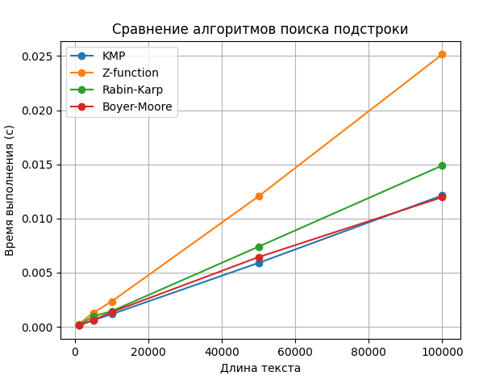
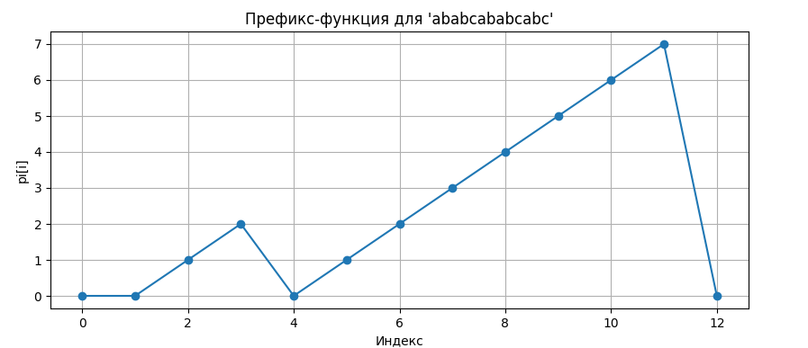
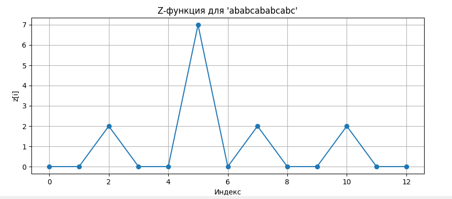

# Отчет по лабораторной работе 11
# Алгоритмы на строках

**Дата:** 2025-10-06
**Семестр:** 3 курс 1 полугодие - 5 семестр
**Группа:** ПИЖ-Б_О-23-1(2)
**Дисциплина:** Анализ сложности алгоритмов
**Студент:** Проценко Дмитрий Максимович

## Цель работы
Изучить специализированные алгоритмы для эффективной работы со строками. Освоить
методы поиска подстрок, вычисление префикс-функции и Z-функции. Получить практические навыки
реализации и анализа алгоритмов обработки строк, исследовать их производительность.

## Теоретическая часть

- Префикс-функция: Для строки S длиной n - массив π[0..n-1], где π[i] - длина наибольшего собственного префикса, который является суффиксом подстроки S[0..i]. Сложность вычисления: O(n).
- Алгоритм Кнута-Морриса-Пратта (KMP): Эффективный алгоритм поиска подстроки, использующий префикс-функцию. Сложность: O(n + m).
- Z-функция: Для строки S длиной n - массив z[0..n-1], где z[i] - длина наибольшего общего префикса строки S и суффикса S[i..n-1]. Сложность вычисления: O(n).
- Поиск подстроки: Помимо KMP существуют алгоритмы Бойера-Мура, Рабина-Карпа, каждый со своими особенностями и областью применения.

Для проведения тестов использовался апарат со следующими комплектующими:
Характеристики ПК для тестирования:
- Процессор: Intel Core i7-12700H @ 2.30GHz
- Оперативная память: 16 GB DDR4
- ОС: Windows 11
- Python: 3.13.1

## Практическая часть

1. Реализовать вычисление префикс-функции для строки.
2. Реализовать алгоритм Кнута-Морриса-Пратта для поиска подстроки.
3. Реализовать вычисление Z-функции.
4. Реализовать один из дополнительных алгоритмов поиска подстроки.
5. Провести сравнительный анализ эффективности алгоритмов на различных данных

### Ключевые фрагменты кода

~~~ python
from typing import List

def prefix_function(s: str) -> List[int]:
    """
    Вычисляет префикс-функцию для строки s.
    pi[i] = длина наибольшего собственного префикса, который совпадает с суффиксом, заканчивающимся в позиции i.
    
    Временная сложность: O(n)
    Пространственная сложность: O(n)
    """
    n = len(s)
    pi = [0] * n
    for i in range(1, n):
        j = pi[i - 1]
        while j > 0 and s[i] != s[j]:
            j = pi[j - 1]
        if s[i] == s[j]:
            j += 1
        pi[i] = j
    return pi

from prefix_function import prefix_function
from typing import List

def kmp_search(text: str, pattern: str) -> List[int]:
    """
    Поиск всех вхождений pattern в text с использованием алгоритма KMP.
    
    Временная сложность: O(n + m)
    Пространственная сложность: O(m)
    """
    if not pattern:
        return []

    combined = pattern + "#" + text
    pi = prefix_function(combined)
    result = []
    m = len(pattern)
    for i in range(m + 1, len(combined)):
        if pi[i] == m:
            result.append(i - 2 * m)
    return result

from typing import List

def z_function(s: str) -> List[int]:
    """
    Вычисляет Z-функцию для строки s.
    Z[i] = длина наибольшего префикса строки, совпадающего с подстрокой, начинающейся в позиции i.
    
    Временная сложность: O(n)
    Пространственная сложность: O(n)
    """
    n = len(s)
    z = [0] * n
    l = r = 0
    for i in range(1, n):
        if i <= r:
            z[i] = min(r - i + 1, z[i - l])
        while i + z[i] < n and s[z[i]] == s[i + z[i]]:
            z[i] += 1
        if i + z[i] - 1 > r:
            l, r = i, i + z[i] - 1
    return z

def z_search(text: str, pattern: str) -> List[int]:
    """
    Поиск всех вхождений pattern в text с использованием Z-функции.
    """
    if not pattern:
        return []

    combined = pattern + "#" + text
    z = z_function(combined)
    m = len(pattern)
    result = []
    for i in range(m + 1, len(combined)):
        if z[i] == m:
            result.append(i - m - 1)
    return result

from typing import List, Dict

def rabin_karp(text: str, pattern: str, prime: int = 101) -> List[int]:
    """
    Алгоритм Рабина-Карпа для поиска подстроки.
    Временная сложность: O(n + m) в среднем, O(n*m) в худшем
    Пространственная сложность: O(1)
    """
    if not pattern:
        return []

    n, m = len(text), len(pattern)
    base = 256
    hpattern = 0
    htext = 0
    h = 1
    result = []

    for i in range(m - 1):
        h = (h * base) % prime

    for i in range(m):
        hpattern = (base * hpattern + ord(pattern[i])) % prime
        htext = (base * htext + ord(text[i])) % prime

    for i in range(n - m + 1):
        if hpattern == htext and text[i:i+m] == pattern:
            result.append(i)
        if i < n - m:
            htext = (base * (htext - ord(text[i]) * h) + ord(text[i + m])) % prime
            if htext < 0:
                htext += prime
    return result

def bad_character_table(pattern: str) -> Dict[str, int]:
    """
    Таблица плохого символа.
    """
    table = {}
    m = len(pattern)
    for i in range(m):
        table[pattern[i]] = i
    return table

def boyer_moore(text: str, pattern: str) -> List[int]:
    """
    Алгоритм Бойера-Мура для поиска подстроки.
    Временная сложность: O(n*m) в худшем, часто O(n/m) в среднем
    Пространственная сложность: O(m)
    """
    if not pattern:
        return []

    m = len(pattern)
    n = len(text)
    result = []
    bad_char = bad_character_table(pattern)
    s = 0

    while s <= n - m:
        j = m - 1
        while j >= 0 and pattern[j] == text[s + j]:
            j -= 1
        if j < 0:
            result.append(s)
            s += (m - bad_char.get(text[s + m], -1)) if s + m < n else 1
        else:
            s += max(1, j - bad_char.get(text[s + j], -1))
    return result

import unittest
from prefix_function import prefix_function
from kmp_search import kmp_search
from z_function import z_search
from string_matching import rabin_karp, boyer_moore

class TestStringAlgorithms(unittest.TestCase):

    def setUp(self):
        self.texts = ["abcabcabc", "aaaaaa", "abracadabra", ""]
        self.patterns = ["abc", "aa", "abra", ""]

    def test_prefix_function(self):
        self.assertEqual(
            prefix_function("abcdabca"),
            [0,0,0,0,1,2,3,1],
            "Ошибка в вычислении префикс-функции для 'abcdabca'"
        )
        print("Тест prefix_function пройден успешно")

    def test_kmp_search(self):
        self.assertEqual(kmp_search("abcabcabc", "abc"), [0,3,6])
        self.assertEqual(kmp_search("aaaaaa", "aa"), [0,1,2,3,4])
        print("Тест kmp_search пройден успешно")

    def test_z_search(self):
        self.assertEqual(z_search("abcabcabc", "abc"), [0,3,6])
        self.assertEqual(z_search("aaaaaa", "aa"), [0,1,2,3,4])
        print("Тест z_search пройден успешно")

    def test_rabin_karp(self):
        self.assertEqual(rabin_karp("abcabcabc", "abc"), [0,3,6])
        print("Тест rabin_karp пройден успешно")

    def test_boyer_moore(self):
        self.assertEqual(boyer_moore("abcabcabc", "abc"), [0,3,6])
        print("Тест boyer_moore пройден успешно")

if __name__ == "__main__":
    unittest.main()

from prefix_function import prefix_function
from kmp_search import kmp_search

def find_all_occurrences(text: str, pattern: str):
    """
    Возвращает список индексов всех вхождений pattern в text.
    Используется алгоритм KMP.
    """
    return kmp_search(text, pattern)

def find_period(s: str):
    """
    Ищет минимальный период строки s.
    Период t строки s означает, что s = t^k для некоторого k.
    Использует префикс-функцию.
    """
    n = len(s)
    if n == 0:
        return 0  # пустая строка не имеет периода
    pi = prefix_function(s)
    period = n - pi[-1]
    if n % period == 0:
        return period
    else:
        return n  # период отсутствует, период = длина строки

def is_cyclic_shift(s1: str, s2: str):
    """
    Проверяет, можно ли получить s2 циклическим сдвигом s1.
    """
    if len(s1) != len(s2):
        return False
    return s2 in (s1 + s1)

if __name__ == "__main__":
    text = "abcabcabc"
    pattern = "abc"
    print("Все вхождения паттерна:", find_all_occurrences(text, pattern))

    s = "ababab"
    print(f"Период строки '{s}':", find_period(s))

    s1 = "abcde"
    s2 = "deabc"
    print(f"'{s2}' является циклическим сдвигом '{s1}'?", is_cyclic_shift(s1, s2))

import matplotlib.pyplot as plt
from prefix_function import prefix_function
from z_function import z_function, z_search
from kmp_search import kmp_search
import time
from string_matching import rabin_karp, boyer_moore

def visualize_prefix_function(s: str):
    pi = prefix_function(s)
    plt.figure(figsize=(10, 4))
    plt.plot(range(len(s)), pi, marker='o')
    plt.title(f"Префикс-функция для '{s}'")
    plt.xlabel("Индекс")
    plt.ylabel("pi[i]")
    plt.grid(True)
    plt.show()

def visualize_z_function(s: str):
    z = z_function(s)
    plt.figure(figsize=(10, 4))
    plt.plot(range(len(s)), z, marker='o')
    plt.title(f"Z-функция для '{s}'")
    plt.xlabel("Индекс")
    plt.ylabel("z[i]")
    plt.grid(True)
    plt.show()

def measure_time(func, text, pattern):
    start = time.time()
    func(text, pattern)
    return time.time() - start

text_lengths = [1000, 5000, 10000, 50000, 100000]
pattern = "abcabc"
times_kmp = []
times_z = []
times_rk = []
times_bm = []

print("Начало эксперимента по сравнению алгоритмов поиска подстроки\n")
for n in text_lengths:
    text = "abc" * (n // 3)
    t_kmp = measure_time(kmp_search, text, pattern)
    t_z = measure_time(z_search, text, pattern)
    t_rk = measure_time(rabin_karp, text, pattern)
    t_bm = measure_time(boyer_moore, text, pattern)

    times_kmp.append(t_kmp)
    times_z.append(t_z)
    times_rk.append(t_rk)
    times_bm.append(t_bm)

    print(f"Длина текста: {n}")
    print(f"  KMP: {t_kmp:.6f} с")
    print(f"  Z-function: {t_z:.6f} с")
    print(f"  Rabin-Karp: {t_rk:.6f} с")
    print(f"  Boyer-Moore: {t_bm:.6f} с\n")

print("Сводка по алгоритмам:")
print(f"Среднее время KMP: {sum(times_kmp)/len(times_kmp):.6f} с")
print(f"Среднее время Z-function: {sum(times_z)/len(times_z):.6f} с")
print(f"Среднее время Rabin-Karp: {sum(times_rk)/len(times_rk):.6f} с")
print(f"Среднее время Boyer-Moore: {sum(times_bm)/len(times_bm):.6f} с\n")

# Построение графика
plt.plot(text_lengths, times_kmp, label="KMP", marker='o')
plt.plot(text_lengths, times_z, label="Z-function", marker='o')
plt.plot(text_lengths, times_rk, label="Rabin-Karp", marker='o')
plt.plot(text_lengths, times_bm, label="Boyer-Moore", marker='o')
plt.xlabel("Длина текста")
plt.ylabel("Время выполнения (с)")
plt.title("Сравнение алгоритмов поиска подстроки")
plt.legend()
plt.grid(True)
plt.show()

if __name__ == "__main__":
    sample_string = "ababcababcabc"
    print(f"Визуализация префикс-функции для строки: {sample_string}")
    visualize_prefix_function(sample_string)
    print(f"Визуализация Z-функции для строки: {sample_string}")
    visualize_z_function(sample_string)
~~~

## Результаты выполнения

### Задания

Все вхождения паттерна: [0, 3, 6]
Период строки 'ababab': 2
'deabc' является циклическим сдвигом 'abcde'? True

### Прохождение тестов

Тест boyer_moore пройден успешно
Тест kmp_search пройден успешно
Тест prefix_function пройден успешно
Тест rabin_karp пройден успешно
Тест z_search пройден успешно

Ran 5 tests in 0.001s

OK

### Результаты выполнения программы

Длина текста: 1000
  KMP: 0.000122 с
  Z-function: 0.000240 с
  Rabin-Karp: 0.000156 с
  Boyer-Moore: 0.000124 с

Длина текста: 5000
  KMP: 0.000621 с
  Z-function: 0.001296 с
  Rabin-Karp: 0.000972 с
  Boyer-Moore: 0.000623 с

Длина текста: 10000
  KMP: 0.001165 с
  Z-function: 0.002344 с
  Rabin-Karp: 0.001440 с
  Boyer-Moore: 0.001357 с

Длина текста: 50000
  KMP: 0.005900 с
  Z-function: 0.012049 с
  Rabin-Karp: 0.007401 с
  Boyer-Moore: 0.006436 с

Длина текста: 100000
  KMP: 0.012130 с
  Z-function: 0.025147 с
  Rabin-Karp: 0.014890 с
  Boyer-Moore: 0.011962 с

Сводка по алгоритмам:
Среднее время KMP: 0.003988 с
Среднее время Z-function: 0.008215 с
Среднее время Rabin-Karp: 0.004972 с
Среднее время Boyer-Moore: 0.004101 с

Визуализация префикс-функции для строки: ababcababcabc
Визуализация Z-функции для строки: ababcababcabc

## Ответы на контрольные вопросы

1. Что такое префикс-функция строки? Как она используется в алгоритме Кнута-Морриса-Пратта (KMP)?

   Префикс-функция для каждой позиции строки показывает длину наибольшего собственного префикса, который совпадает с суффиксом, оканчивающимся в этой позиции. В KMP она используется, чтобы при несовпадении не возвращаться в начало строки, а сразу продолжать поиск с позиции, соответствующей префиксу.

2. В чем основное преимущество алгоритма KMP перед наивным алгоритмом поиска подстроки? Проиллюстрируйте на примере.

   Основное преимущество KMP — линейное время поиска, независимо от повторяющихся символов. Например, при поиске "AAAAB" в строке "AAAAAAAAAB" наивный алгоритм будет многократно проверять одни и те же символы, а KMP сразу использует информацию о совпадениях.

3. Опишите, что такое Z-функция строки. Как с ее помощью можно решить задачу поиска подстроки?

   Z-функция для каждой позиции строки показывает длину наибольшего префикса строки, совпадающего с подстрокой, начинающейся в этой позиции. Для поиска подстроки строят Z-функцию от строки вида "паттерн#текст" и ищут позиции, где Z-функция равна длине паттерна.

4. В чем заключается идея алгоритма Бойера-Мура? Какие эвристики он использует для ускорения поиска?

   Идея Бойера-Мура — сравнивать подстроку с текстом справа налево и сдвигать окно поиска максимально возможным шагом. Алгоритм использует эвристики плохого символа (bad character) и хорошего суффикса (good suffix) для ускорения сдвигов.

5. Для каких практических задач, помимо поиска подстроки, могут применяться префикс- и Z-функции (например, поиск периода строки)?

   Префикс- и Z-функции применяются для поиска периодов строки, проверки палиндромов, построения суффиксных структур, сжатия текста и анализа повторов в биоинформатике.
