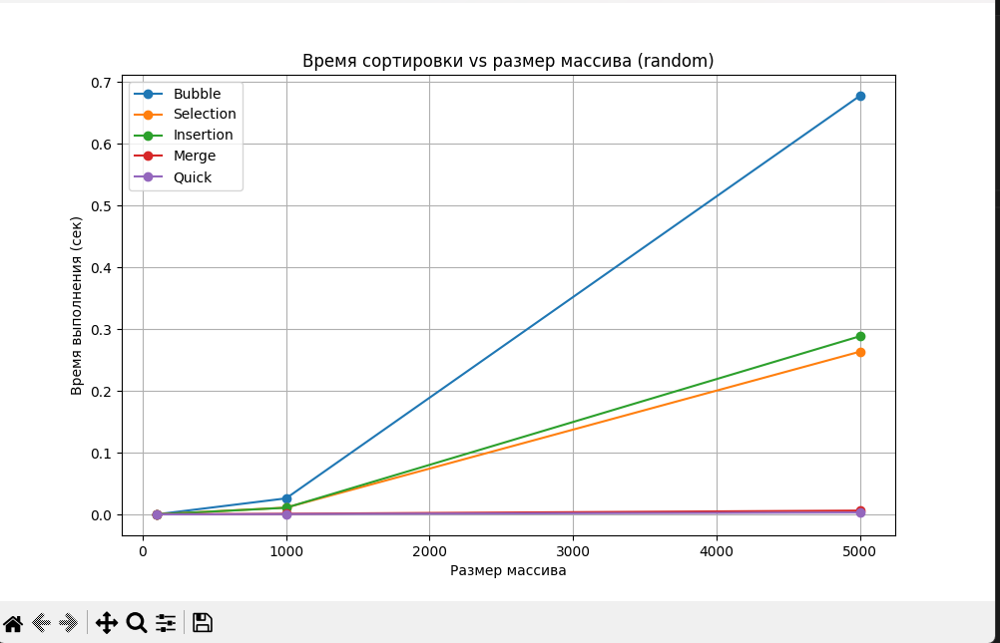
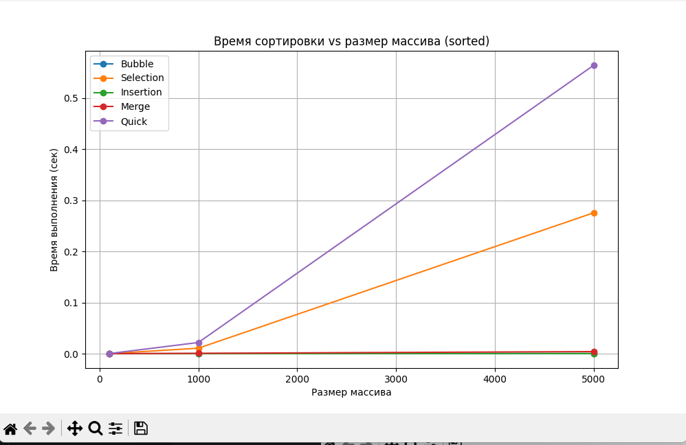
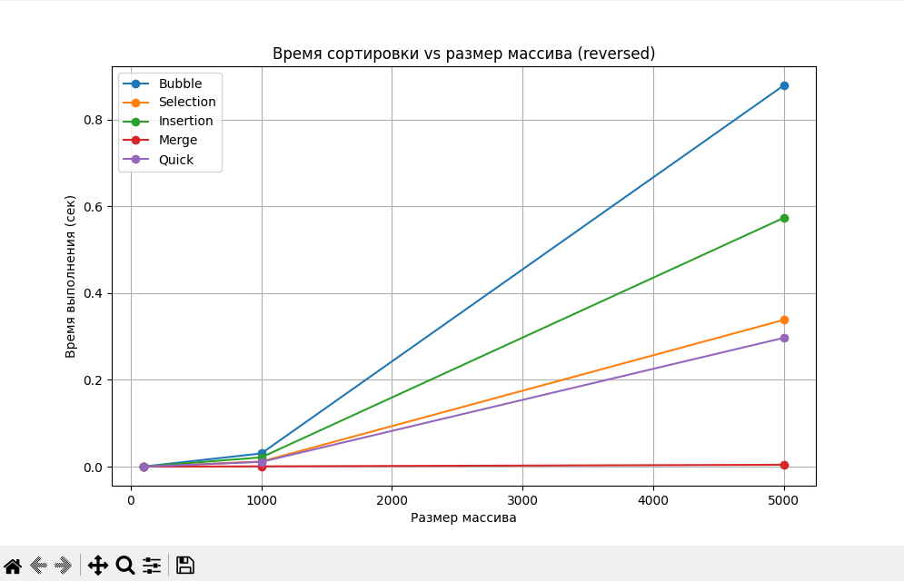

# Отчет по лабораторной работе 4
# Алгоритмы сортировки

**Дата:** 2025-10-06
**Семестр:** 3 курс 1 полугодие - 5 семестр
**Группа:** ПИЖ-Б_О-23-1(2)
**Дисциплина:** Анализ сложности алгоритмов
**Студент:** Проценко Дмитрий Максимович

## Цель работы
Цель работы: Изучить и реализовать основные алгоритмы сортировки. Провести их теоретический и
практический сравнительный анализ по временной и пространственной сложности. Исследовать
влияние начальной упорядоченности данных на эффективность алгоритмов. Получить навыки
эмпирического анализа производительности алгоритмов.

## Теоретическая часть

- Сортировка пузырьком (Bubble Sort): Многократно проходит по массиву, сравнивая и меняя
местами соседние элементы. Сложность: O(n²) во всех случаях.
- Сортировка выбором (Selection Sort): На каждом проходе находит минимальный элемент из
неотсортированной части и ставит его на очередную позицию. Сложность: O(n²).
- Сортировка вставками (Insertion Sort): Построение окончательного массива путем пошагового
вставления каждого элемента в правильную позицию в уже отсортированной части. Сложность:
O(n²) в худшем и среднем, O(n) в лучшем (уже отсортированный массив).
- Сортировка слиянием (Merge Sort): Рекурсивный алгоритм "разделяй и властвуй". Массив
разбивается на две части, которые сортируются рекурсивно, а затем сливаются в один
отсортированный массив. Сложность: O(n log n) во всех случаях. Требует O(n) дополнительной
памяти.
- Быстрая сортировка (Quick Sort): Рекурсивный алгоритм "разделяй и властвуй". Выбирается
опорный элемент, массив разделяется на элементы меньше и больше опорного, которые
сортируются рекурсивно. Сложность: O(n log n) в среднем, O(n²) в худшем случае (плохой выбор
опорного элемента). Сортировка на месте, не требует дополнительной памяти.

Для проведения тестов использовался апарат со следующими комплектующими:
Характеристики ПК для тестирования:
- Процессор: Intel Core i7-12700H @ 2.30GHz
- Оперативная память: 16 GB DDR4
- ОС: Windows 11
- Python: 3.13.1

## Практическая часть

1. Реализовать 5 алгоритмов сортировки.
2. Провести теоретический анализ сложности каждого алгоритма.
3. Экспериментально сравнить время выполнения алгоритмов на различных наборах данных.
4. Проанализировать влияние начальной упорядоченности данных на эффективность сортировок.

### Ключевые фрагменты кода

~~~ python

def bubble_sort(arr):
    """
    Bubble Sort
    Лучший случай:     O(n)        — если массив уже отсортирован
    Средний случай:    O(n^2)
    Худший случай:     O(n^2)
    Память:            O(1)        — сортировка на месте
    """
    n = len(arr)
    for i in range(n):
        swapped = False
        for j in range(0, n - i - 1):
            if arr[j] > arr[j + 1]:
                arr[j], arr[j + 1] = arr[j + 1], arr[j]
                swapped = True
        if not swapped:
            break
    return arr

def insertion_sort(arr):
    """
    Insertion Sort
    Лучший случай:     O(n)        — почти отсортированный массив
    Средний случай:    O(n^2)
    Худший случай:     O(n^2)
    Память:            O(1)
    """
    for i in range(1, len(arr)):
        key = arr[i]
        j = i - 1

        while j >= 0 and arr[j] > key:
            arr[j + 1] = arr[j]
            j -= 1

        arr[j + 1] = key
    return arr

def selection_sort(arr):
    """
    Selection Sort
    Лучший случай:     O(n^2)
    Средний случай:    O(n^2)
    Худший случай:     O(n^2)
    Память:            O(1)
    """
    for i in range(len(arr)):
        min_idx = i
        for j in range(i + 1, len(arr)):
            if arr[j] < arr[min_idx]:
                min_idx = j
        arr[i], arr[min_idx] = arr[min_idx], arr[i]
    return arr

def merge_sort(arr):
    """
    Merge Sort
    Лучший случай:     O(n log n)
    Средний случай:    O(n log n)
    Худший случай:     O(n log n)
    Память:            O(n)        — требует дополнительный массив
    """
    if len(arr) <= 1:
        return arr

    mid = len(arr) // 2
    left = merge_sort(arr[:mid])
    right = merge_sort(arr[mid:])

    
    def merge(left, right):
        result = []
        i = j = 0

        while i < len(left) and j < len(right):
            if left[i] <= right[j]:
                result.append(left[i])
                i += 1
            else:
                result.append(right[j])
                j += 1

        result.extend(left[i:])
        result.extend(right[j:])
        return result

    return merge(left, right)

def quick_sort(arr):
    """
    Quick Sort
    Лучший случай:     O(n log n)
    Средний случай:    O(n log n)
    Худший случай:     O(n^2)      — если pivot выбран неудачно
    Память:            O(log n)    — глубина рекурсии
    """
    def _quick_sort(a, low, high):
        if low < high:
            p = partition(a, low, high)
            _quick_sort(a, low, p - 1)
            _quick_sort(a, p + 1, high)

    def partition(a, low, high):
        pivot = a[high]
        i = low
        for j in range(low, high):
            if a[j] <= pivot:
                a[i], a[j] = a[j], a[i]
                i += 1
        a[i], a[high] = a[high], a[i]
        return i

    _quick_sort(arr, 0, len(arr) - 1)
    return arr

import random

def generate_datasets(sizes):
    datasets = {}

    for n in sizes:
        random_arr = [random.randint(0, n) for _ in range(n)]
        sorted_arr = sorted(random_arr)
        reversed_arr = sorted_arr[::-1]
        almost_sorted = sorted_arr.copy()
        k = n // 20
        for _ in range(k):
            i = random.randint(0, n - 1)
            j = random.randint(0, n - 1)
            almost_sorted[i], almost_sorted[j] = almost_sorted[j], almost_sorted[i]
        datasets[n] = {
            "random": random_arr,
            "sorted": sorted_arr,
            "reversed": reversed_arr,
            "almost_sorted": almost_sorted
        }

    return datasets
    

import matplotlib.pyplot as plt

time_data = {}

def plot_creater(sort_name, size, time_sec, data_type="random"):
    """
    sort_name : str -> название алгоритма
    size      : int -> размер массива
    time_sec  : float -> время выполнения
    data_type : str -> тип данных ("random", "sorted", etc.)
    """
    global time_data
    if data_type not in time_data:
        time_data[data_type] = {}
    if sort_name not in time_data[data_type]:
        time_data[data_type][sort_name] = {"sizes": [], "times": []}

    time_data[data_type][sort_name]["sizes"].append(size)
    time_data[data_type][sort_name]["times"].append(time_sec)

def plot_graph(data_type="random"):
    """
    Построение графика зависимости времени сортировки от размера массива
    для указанного типа данных
    """
    global time_data
    if data_type not in time_data:
        print(f"Нет данных для {data_type}")
        return

    plt.figure(figsize=(10,6))
    for sort_name, d in time_data[data_type].items():
        plt.plot(d["sizes"], d["times"], marker='o', label=sort_name)
    plt.xlabel("Размер массива")
    plt.ylabel("Время выполнения (сек)")
    plt.title(f"Время сортировки vs размер массива ({data_type})")
    plt.legend()
    plt.grid(True)
    plt.show()

from generate_data import generate_datasets
from sorts import *
import timeit
import sys
import plot_result 

sys.setrecursionlimit(10000) 

SIZES = [100, 1000, 5000]

SORTS = {
    "Bubble": bubble_sort,
    "Selection": selection_sort,
    "Insertion": insertion_sort,
    "Merge": merge_sort,
    "Quick": quick_sort
}

def measure_time(sort_fn, arr, runs=5):
    statement = "sort_fn(test_arr.copy())"
    setup = (
        "from __main__ import sort_fn, test_arr"
    )

    global sort_fn_global, test_arr
    sort_fn_global = sort_fn
    test_arr = arr

    total_time = timeit.timeit(
        stmt="sort_fn_global(test_arr.copy())",
        number=runs,
        globals=globals()
    )

    return total_time / runs

if __name__ == "__main__":
    datasets = generate_datasets(SIZES)
    print("\n=== BENCHMARK START ===\n")
    for size, types in datasets.items():
        print(f"\n------------------------------")
        print(f"Размер массива: {size}")
        print(f"------------------------------\n")
        for data_type, arr in types.items():
            print(f"\nТип данных: {data_type}")
            for sort_name, sort_fn in SORTS.items():
                time_sec = measure_time(sort_fn, arr)
                plot_result.plot_creater(sort_name, size, time_sec, data_type)
    plot_result.plot_graph("random")  # график для случайных данных
    plot_result.plot_graph("sorted")  # график для отсортированных данных
    plot_result.plot_graph("reversed")  # график для обратного порядка
    plot_result.plot_graph("almost_sorted")  # почти отсортированные

~~~

## Результаты выполнения

### Пример работы программы

## Ответы на контрольные вопросы

1. Какие алгоритмы сортировки имеют сложность O(n²) в худшем случае, а какие — O(n log n)?
 - O(n²): Bubble Sort, Insertion Sort, Selection Sort, худший случай Quick Sort (при плохом выборе опорного элемента).
 - O(n log n): Merge Sort, Heap Sort, средний случай Quick Sort.

2. Почему сортировка вставками (Insertion Sort) эффективна для маленьких или почти отсортированных массивов?
Потому что она делает минимальное количество операций, когда элементы уже почти на своих местах.
Затраты на сравнения и сдвиги становятся очень малыми, а накладных расходов почти нет.

3. В чем разница между устойчивой (stable) и неустойчивой (unstable) сортировкой? Пример.
Устойчивая сортировка сохраняет относительный порядок элементов с одинаковыми значениями.
Неустойчивая — может менять порядок равных элементов.
Примеры:
Устойчивые: Insertion Sort, Merge Sort, Bubble Sort.
Неустойчивые: Quick Sort, Selection Sort.

4. Опишите принцип работы Quick Sort. Что такое опорный элемент и как его выбор влияет на производительность?
Quick Sort выбирает опорный элемент (pivot), делит массив на две части — меньше pivot и больше pivot — и рекурсивно сортирует части.
Если pivot выбран плохо (например, всегда минимальный/максимальный в почти отсортированном массиве), производительность падает до O(n²).
Хороший pivot даёт усреднённое O(n log n).

5. Когда Merge Sort предпочтительнее Quick Sort?
 - Когда важна стабильность сортировки.
 - Когда данные не помещаются в память (внешняя сортировка).
 - Когда нужна гарантированная сложность O(n log n) независимо от данных.