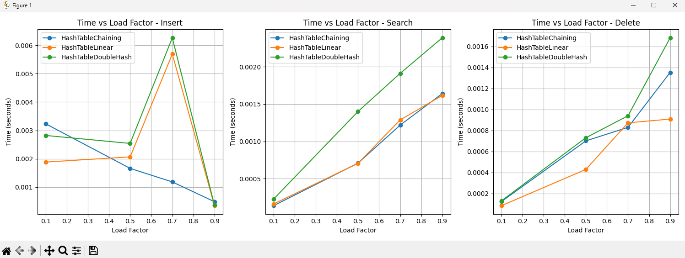
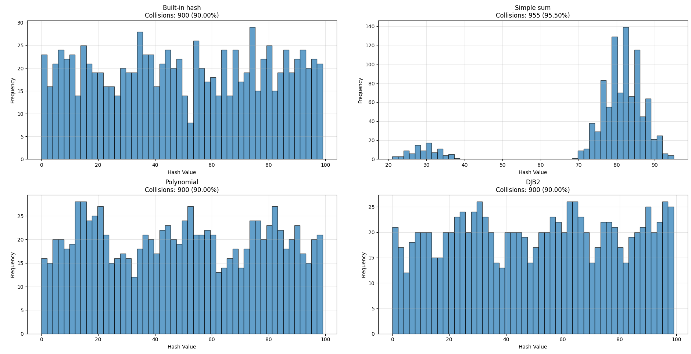

# Отчет по лабораторной работе 5
#  Хеш-функции и хеш-таблицы

**Дата:** 2025-10-06
**Семестр:** 3 курс 1 полугодие - 5 семестр
**Группа:** ПИЖ-Б_О-23-1(2)
**Дисциплина:** Анализ сложности алгоритмов
**Студент:** Проценко Дмитрий Максимович

## Цель работы
Цель работы: Изучить принципы работы хеш-функций и хеш-таблиц. Освоить методы разрешения
коллизий. Получить практические навыки реализации хеш-таблицы с различными стратегиями
разрешения коллизий. Провести сравнительный анализ эффективности разных методов.

## Теоретическая часть

- Хеш-функция: Функция, преобразующая произвольные данные в данные фиксированного
размера (хеш-код). Требования: детерминированность, равномерное распределение, скорость
вычисления.
- Хеш-таблица: Структура данных, реализующая ассоциативный массив. Обеспечивает в среднем
O(1) для операций вставки, поиска и удаления.
Коллизия: Ситуация, когда разные ключи имеют одинаковый хеш-код.
- Метод цепочек (Chaining): Каждая ячейка таблицы содержит список элементов с одинаковым
хешем. Сложность: O(1 + α), где α - коэффициент заполнения.
- Открытая адресация (Open Addressing): Все элементы хранятся в самом массиве. При коллизии
ищется следующая свободная ячейка согласно probe sequence.
- Двойное хеширование (Double Hashing): Метод открытой адресации, использующий вторую
хеш-функцию для определения шага probing.

Для проведения тестов использовался апарат со следующими комплектующими:
Характеристики ПК для тестирования:
- Процессор: Intel Core i7-12700H @ 2.30GHz
- Оперативная память: 16 GB DDR4
- ОС: Windows 11
- Python: 3.13.1

## Практическая часть

1. Реализовать несколько хеш-функций для строковых ключей.
2. Реализовать хеш-таблицу с методом цепочек.
3. Реализовать хеш-таблицу с открытой адресацией (линейное пробирование и двойное
хеширование).
4. Провести сравнительный анализ эффективности разных методов разрешения коллизий.
5. Исследовать влияние коэффициента заполнения на производительность.

### Ключевые фрагменты кода

~~~ python
def hash_sum(s, size):
    """Функция вычисляет хеш-сумму строки через сумму ASCII кодов символов
    Проходит по всем символам строки s, преобразует каждый в ASCII код и суммирует"""
    return sum(ord(c) for c in s) % size  # Берем остаток от деления на size для ограничения диапазона

def hash_poly(s, size, p=31):
    """Полиномиальная хеш-функция (работает по принципу многочлена)"""
    hash_value = 0  # Инициализируем начальное значение хеша
    for c in s:  # Проходим по каждому символу в строке
        # Умножаем текущий хеш на простое число p и добавляем ASCII код символа
        # Это создает зависимость от порядка символов в строке
        hash_value = hash_value * p + ord(c)
    return hash_value % size  # Берем остаток от деления для ограничения диапазона

def hash_djb2(s, size):
    """Алгоритм djb2 - популярная хеш-функция Дэниела Бернстайна"""
    hash_value = 5381  # Начальное значение (простое число)
    for c in s:  # Проходим по каждому символу в строке
        # (hash_value << 5) - сдвиг влево на 5 бит + hash_value
        # + ord(c) - добавляет ASCII код текущего символа
        hash_value = ((hash_value << 5) + hash_value) + ord(c)
    return hash_value % size  # Берем остаток от деления для ограничения диапазона

from typing import Optional, Tuple, List

class HashTableChaining:
    def __init__(self, size: int = 8):
        # size корзин (bucket'ов)
        self.size = max(1, size)
        # Каждая корзина — список (цепочка)
        self.table: List[List[Tuple[object, object]]] = [[] for _ in range(self.size)]
        self.count = 0

    def _resize(self):
        """Рехеширование при превышении load factor."""
        old_table = self.table
        self.size *= 2
        self.table = [[] for _ in range(self.size)]
        self.count = 0

        # Перемещаем всё в новую таблицу
        for bucket in old_table:
            for k, v in bucket:
                self.insert(k, v)

    def insert(self, key, value):
        """Вставка в цепочке."""
        index = hash(key) % self.size
        bucket = self.table[index]

        # Ищем ключ — если найден, обновляем
        for i, (k, _) in enumerate(bucket):
            if k == key:
                bucket[i] = (key, value)
                return

        # Иначе добавляем в конец цепочки
        bucket.append((key, value))
        self.count += 1

        # При load_factor > 0.75 — удвоение таблицы
        if self.count / self.size > 0.75:
            self._resize()

    def search(self, key):
        """Поиск в цепочке."""
        index = hash(key) % self.size
        bucket = self.table[index]

        for k, v in bucket:
            if k == key:
                return v
        return None

    def delete(self, key) -> bool:
        """Удаление из цепочки."""
        index = hash(key) % self.size
        bucket = self.table[index]

        for i, (k, _) in enumerate(bucket):
            if k == key:
                bucket.pop(i)
                self.count -= 1
                return True

        return False

from typing import Optional, Tuple, List

class HashTableLinear:
    def __init__(self, size: int = 8):
        # Минимальный размер таблицы — 2
        self.size = max(2, size)
        # Внутренний массив слотов
        # Каждый слот — либо None, либо (key, value), либо маркер deleted
        self.table: List[Optional[Tuple[object, object]]] = [None] * self.size
        # Уникальный объект, обозначающий удалённый элемент
        self.deleted = object()
        # Количество действительных записей (без учёта deleted)
        self.count = 0

    def _resize(self):
        """Увеличение размера таблицы в 2 раза с ре-хешированием."""
        old_table = self.table
        old_size = self.size

        # Увеличиваем размер
        self.size *= 2
        self.table = [None] * self.size
        self.count = 0  # Пересчитаем при вставке

        # Вставляем старые элементы заново
        for slot in old_table:
            if isinstance(slot, tuple) and len(slot) == 2:
                self.insert(slot[0], slot[1])

    def insert(self, key, value):
        """Вставка элемента с линейным пробированием."""
        index = hash(key) % self.size
        first_deleted_index = None  # запомним первую встреченную "дыру"

        while True:
            slot = self.table[index]

            if slot is None:
                # Место пустое — вставляем
                if first_deleted_index is not None:
                    # Лучше заполнить ранее встреченную "дыру"
                    self.table[first_deleted_index] = (key, value)
                else:
                    self.table[index] = (key, value)
                self.count += 1
                break

            if slot is self.deleted:
                # Встретили удалённый слот — возможно, вставим сюда
                if first_deleted_index is None:
                    first_deleted_index = index
            else:
                # Валидный слот
                stored_key, _ = slot
                if stored_key == key:
                    # Ключ уже есть — заменяем значение
                    self.table[index] = (key, value)
                    return

            # Переходим к следующему индексу (линейный шаг = 1)
            index = (index + 1) % self.size

        # Проверка load factor (заполненности)
        if self.count / self.size > 0.7:
            self._resize()

    def search(self, key):
        """Поиск элемента с линейным пробированием."""
        index = hash(key) % self.size
        start = index  # чтобы не зациклиться

        while True:
            slot = self.table[index]

            if slot is None:
                # Пустой слот означает — ключ не встречался
                return None

            if slot is not self.deleted:
                stored_key, stored_value = slot
                if stored_key == key:
                    return stored_value

            # Линейный шаг
            index = (index + 1) % self.size

            if index == start:
                # полный круг — ключ не найден
                return None

    def delete(self, key) -> bool:
        """Удаление ключа. Возвращает True, если удалён."""
        index = hash(key) % self.size
        start = index

        while True:
            slot = self.table[index]

            if slot is None:
                # Пустой слот — значит ключа точно нет
                return False

            if slot is not self.deleted:
                stored_key, _ = slot
                if stored_key == key:
                    # Заменяем запись маркером deleted
                    self.table[index] = self.deleted
                    self.count -= 1
                    return True

            index = (index + 1) % self.size
            if index == start:
                return False

class HashTableDoubleHash:
    def __init__(self, size: int = 8):
        # Минимальный размер 3 (для h2 — шаг не должен быть 0)
        self.size = max(3, size)
        self.table: List[Optional[Tuple[object, object]]] = [None] * self.size
        self.deleted = object()
        self.count = 0

    def _h1(self, key) -> int:
        """Основная хеш-функция."""
        return hash(key) % self.size

    def _h2(self, key) -> int:
        """Вторичная хеш-функция — шаг пробирования.
        Должен быть всегда > 0.
        Дарит лучшую дисперсию, чем линейное пробирование."""
        return 1 + (hash(key) % (self.size - 1))

    def _resize(self):
        """Расширение таблицы с ре-хешированием."""
        old_table = self.table
        self.size *= 2
        self.table = [None] * self.size
        self.count = 0

        for slot in old_table:
            if isinstance(slot, tuple) and len(slot):
                self.insert(slot[0], slot[1])

    def insert(self, key, value):
        """Вставка с двойным хешированием."""
        index = self._h1(key)
        step = self._h2(key)
        first_deleted_index = None

        while True:
            slot = self.table[index]

            if slot is None:
                # Пустое место для вставки
                if first_deleted_index is not None:
                    self.table[first_deleted_index] = (key, value)
                else:
                    self.table[index] = (key, value)
                self.count += 1
                break

            if slot is self.deleted:
                if first_deleted_index is None:
                    first_deleted_index = index
            else:
                # Валидная запись
                stored_key, _ = slot
                if stored_key == key:
                    # Обновление
                    self.table[index] = (key, value)
                    return

            # Прыжок по шагу h2
            index = (index + step) % self.size

        if self.count / self.size > 0.7:
            self._resize()

    def search(self, key):
        """Поиск с двойным хешированием."""
        index = self._h1(key)
        step = self._h2(key)
        start = index

        while True:
            slot = self.table[index]
            if slot is None:
                return None

            if slot is not self.deleted:
                stored_key, stored_value = slot
                if stored_key == key:
                    return stored_value

            index = (index + step) % self.size
            if index == start:
                return None

    def delete(self, key) -> bool:
        """Удаление в таблице с двойным хешированием."""
        index = self._h1(key)
        step = self._h2(key)
        start = index

        while True:
            slot = self.table[index]
            if slot is None:
                return False

            if slot is not self.deleted:
                stored_key, _ = slot
                if stored_key == key:
                    self.table[index] = self.deleted
                    self.count -= 1
                    return True

            index = (index + step) % self.size
            if index == start:
                return False

import unittest
import time
import matplotlib.pyplot as plt
import numpy as np
from itertools import product
from hash_functions import *
from hash_table_openaddressing import *
from hash_table_chaining import *

class TestHashTables(unittest.TestCase):
    
    def setUp(self):
        """Инициализация тестовых данных"""
        self.test_data = [
            ("key1", "value1"),
            ("key2", "value2"), 
            ("key3", "value3"),
            ("key4", "value4"),
            ("key5", "value5"),
            ("collision_key", "collision_value")  # Для теста коллизий
        ]
        
    def test_basic_operations(self):
        """Тест базовых операций для всех реализаций хеш-таблиц"""
        implementations = [HashTableChaining, HashTableLinear, HashTableDoubleHash]
        
        for impl in implementations:
            with self.subTest(implementation=impl.__name__):
                ht = impl(size=4)  # Маленький размер для теста коллизий
                
                # Тест вставки
                for key, value in self.test_data:
                    ht.insert(key, value)
                
                # Тест поиска
                for key, expected_value in self.test_data:
                    self.assertEqual(ht.search(key), expected_value)
                
                # Тест обновления значения
                ht.insert("key1", "updated_value")
                self.assertEqual(ht.search("key1"), "updated_value")
                
                # Тест удаления
                self.assertTrue(ht.delete("key1"))
                self.assertIsNone(ht.search("key1"))
                self.assertFalse(ht.delete("nonexistent_key"))
    
    def test_collision_handling(self):
        """Тест обработки коллизий"""
        # Создаем ключи, которые гарантированно вызовут коллизии
        collision_keys = ["a", "b", "c", "d", "e", "f", "g"]
        
        implementations = [HashTableChaining, HashTableLinear, HashTableDoubleHash]
        
        for impl in implementations:
            with self.subTest(implementation=impl.__name__):
                ht = impl(size=3)  # Очень маленький размер для принудительных коллизий
                
                # Вставляем все ключи
                for i, key in enumerate(collision_keys):
                    ht.insert(key, f"value{i}")
                
                # Проверяем, что все значения доступны
                for i, key in enumerate(collision_keys):
                    self.assertEqual(ht.search(key), f"value{i}")
    
    def test_resize_operation(self):
        """Тест операции изменения размера"""
        implementations = [HashTableChaining, HashTableLinear, HashTableDoubleHash]
        
        for impl in implementations:
            with self.subTest(implementation=impl.__name__):
                ht = impl(size=2)  # Начинаем с очень маленького размера
                
                # Вставляем больше элементов, чем начальный размер
                for i in range(10):
                    ht.insert(f"key{i}", f"value{i}")
                
                # Проверяем, что все значения доступны после resize
                for i in range(10):
                    self.assertEqual(ht.search(f"key{i}"), f"value{i}")
                
                # Проверяем, что размер увеличился
                self.assertGreater(ht.size, 2)

class HashTableBenchmark:
    """Класс для benchmarking хеш-таблиц"""
    
    def __init__(self):
        self.implementations = [HashTableChaining, HashTableLinear, HashTableDoubleHash]
        self.load_factors = [0.1, 0.5, 0.7, 0.9]
        self.operations = ['insert', 'search', 'delete']
        
    def generate_test_data(self, size):
        """Генерация тестовых данных"""
        return [(
            f"key_{i}", 
            f"value_{i}"
        ) for i in range(size)]
    
    def measure_operation_time(self, implementation, load_factor, operation, data_size=10000):
        """Измерение времени выполнения операции"""
        # Вычисляем размер таблицы для достижения нужного коэффициента заполнения
        table_size = int(data_size / load_factor)
        ht = implementation(size=table_size)
        test_data = self.generate_test_data(data_size)
        
        # Предварительно заполняем таблицу
        for key, value in test_data[:int(data_size * load_factor)]:
            ht.insert(key, value)
        
        # Измеряем время выполнения операции
        start_time = time.time()
        
        if operation == 'insert':
            # Вставляем оставшиеся элементы
            for key, value in test_data[int(data_size * load_factor):]:
                ht.insert(key, value)
        elif operation == 'search':
            # Ищем все элементы
            for key, _ in test_data[:int(data_size * load_factor)]:
                ht.search(key)
        elif operation == 'delete':
            # Удаляем половину элементов
            for key, _ in test_data[:int(data_size * load_factor) // 2]:
                ht.delete(key)
        
        end_time = time.time()
        return end_time - start_time
    
    def run_benchmarks(self):
        """Запуск всех benchmark тестов"""
        results = {}
        
        for impl, load_factor, operation in product(self.implementations, self.load_factors, self.operations):
            impl_name = impl.__name__
            if impl_name not in results:
                results[impl_name] = {}
            if operation not in results[impl_name]:
                results[impl_name][operation] = []
                
            time_taken = self.measure_operation_time(impl, load_factor, operation)
            results[impl_name][operation].append((load_factor, time_taken))
            
            print(f"{impl_name} - Load factor: {load_factor} - {operation}: {time_taken:.6f}s")
        
        return results
    
    def plot_performance(self, results):
        """Построение графиков производительности"""
        fig, axes = plt.subplots(1, 3, figsize=(15, 5))
        
        for idx, operation in enumerate(self.operations):
            ax = axes[idx]
            for impl_name in results:
                load_factors = [lf for lf, _ in results[impl_name][operation]]
                times = [t for _, t in results[impl_name][operation]]
                ax.plot(load_factors, times, marker='o', label=impl_name)
            
            ax.set_title(f'Time vs Load Factor - {operation.capitalize()}')
            ax.set_xlabel('Load Factor')
            ax.set_ylabel('Time (seconds)')
            ax.legend()
            ax.grid(True)
        
        plt.tight_layout()
        plt.savefig('hash_table_performance.png', dpi=300, bbox_inches='tight')
        plt.show()
    
    def analyze_collisions(self, hash_functions, test_size=1000, table_size=100):
        """Анализ коллизий для разных хеш-функций"""
        collision_stats = {}
        
        for func_name, hash_func in hash_functions.items():
            hash_values = []
            test_data = self.generate_test_data(test_size)
            
            for key, _ in test_data:
                hash_val = hash_func(key, table_size)
                hash_values.append(hash_val)
            
            # Анализ распределения
            unique_hashes = len(set(hash_values))
            collisions = test_size - unique_hashes
            collision_rate = collisions / test_size
            
            collision_stats[func_name] = {
                'collisions': collisions,
                'collision_rate': collision_rate,
                'distribution': hash_values
            }
            
            print(f"{func_name}: {collisions} collisions ({collision_rate:.2%})")
        
        return collision_stats
    
    def plot_collision_distribution(self, collision_stats):
        """Построение гистограмм распределения коллизий"""
        fig, axes = plt.subplots(2, 2, figsize=(12, 10))
        axes = axes.flatten()
        
        for idx, (func_name, stats) in enumerate(collision_stats.items()):
            if idx >= len(axes):
                break
                
            ax = axes[idx]
            distribution = stats['distribution']
            
            ax.hist(distribution, bins=50, alpha=0.7, edgecolor='black')
            ax.set_title(f'{func_name}\nCollisions: {stats["collisions"]} ({stats["collision_rate"]:.2%})')
            ax.set_xlabel('Hash Value')
            ax.set_ylabel('Frequency')
            ax.grid(True, alpha=0.3)
        
        plt.tight_layout()
        plt.savefig('hash_function_collisions.png', dpi=300, bbox_inches='tight')
        plt.show()

def custom_hash_simple(key, size):
    """Простая хеш-функция для сравнения"""
    return sum(ord(c) for c in key) % size

def custom_hash_poly(key, size):
    """Полиномиальная хеш-функция"""
    p = 31
    hash_val = 0
    for c in key:
        hash_val = hash_val * p + ord(c)
    return hash_val % size

# Запуск тестов и benchmark
if __name__ == "__main__":
    # Запуск unit-тестов
    unittest.main(argv=[''], exit=False, verbosity=2)
    
    # Benchmark тесты
    benchmark = HashTableBenchmark()
    
    print("\n" + "="*50)
    print("RUNNING PERFORMANCE BENCHMARKS")
    print("="*50)
    
    # Тесты производительности
    performance_results = benchmark.run_benchmarks()
    benchmark.plot_performance(performance_results)
    
    print("\n" + "="*50)
    print("ANALYZING HASH FUNCTION COLLISIONS")
    print("="*50)
    
    # Анализ коллизий хеш-функций
    hash_functions = {
        'Built-in hash': lambda k, s: hash(k) % s,
        'Simple sum': custom_hash_simple,
        'Polynomial': custom_hash_poly,
        'DJB2': lambda k, s: hash_djb2(k, s)
    }
    
    collision_stats = benchmark.analyze_collisions(hash_functions)
    benchmark.plot_collision_distribution(collision_stats)
    
    # Анализ результатов
    print("\n" + "="*50)
    print("PERFORMANCE ANALYSIS SUMMARY")
    print("="*50)
    
    for impl_name in performance_results:
        print(f"\n{impl_name}:")
        for operation in benchmark.operations:
            times = [t for _, t in performance_results[impl_name][operation]]
            best_lf = benchmark.load_factors[np.argmin(times)]
            print(f"  {operation}: Best load factor = {best_lf}")

# Дополнительные функции для анализа
def analyze_optimal_load_factors(performance_results):
    """Анализ оптимальных коэффициентов заполнения"""
    optimal_factors = {}
    
    for impl_name in performance_results:
        optimal_factors[impl_name] = {}
        for operation in ['insert', 'search', 'delete']:
            times = [t for _, t in performance_results[impl_name][operation]]
            optimal_idx = np.argmin(times)
            optimal_factors[impl_name][operation] = benchmark.load_factors[optimal_idx]
    
    return optimal_factors

def compare_implementation_efficiency(performance_results):
    """Сравнение эффективности реализаций"""
    efficiency_scores = {}
    
    for impl_name in performance_results:
        total_score = 0
        for operation in benchmark.operations:
            times = [t for _, t in performance_results[impl_name][operation]]
            # Чем меньше время, тем выше score
            score = 1 / np.mean(times)
            total_score += score
        
        efficiency_scores[impl_name] = total_score
    
    return efficiency_scores
~~~

## Результаты выполнения

### Пройденные тесты программы

test_basic_operations (__main__.TestHashTables.test_basic_operations)
Тест базовых операций для всех реализаций хеш-таблиц ... ok
test_collision_handling (__main__.TestHashTables.test_collision_handling)
Тест обработки коллизий ... ok
test_resize_operation (__main__.TestHashTables.test_resize_operation)
Тест операции изменения размера ... ok

----------------------------------------------------------------------
Ran 3 tests in 0.002s

OK

### Пример работы программы

RUNNING PERFORMANCE BENCHMARKS
HashTableChaining - Load factor: 0.1 - insert: 0.003229s 
HashTableChaining - Load factor: 0.1 - search: 0.000139s
HashTableChaining - Load factor: 0.1 - delete: 0.000125s
HashTableChaining - Load factor: 0.5 - insert: 0.001659s
HashTableChaining - Load factor: 0.5 - search: 0.000709s
HashTableChaining - Load factor: 0.5 - delete: 0.000701s
HashTableChaining - Load factor: 0.7 - insert: 0.001182s
HashTableChaining - Load factor: 0.7 - search: 0.001218s
HashTableChaining - Load factor: 0.7 - delete: 0.000830s
HashTableChaining - Load factor: 0.9 - insert: 0.000484s
HashTableChaining - Load factor: 0.9 - search: 0.001640s
HashTableChaining - Load factor: 0.9 - delete: 0.001353s
HashTableLinear - Load factor: 0.1 - insert: 0.001883s
HashTableLinear - Load factor: 0.1 - search: 0.000163s
HashTableLinear - Load factor: 0.1 - delete: 0.000085s
HashTableLinear - Load factor: 0.5 - insert: 0.002064s
HashTableLinear - Load factor: 0.5 - search: 0.000706s
HashTableLinear - Load factor: 0.5 - delete: 0.000430s
HashTableLinear - Load factor: 0.7 - insert: 0.005694s
HashTableLinear - Load factor: 0.7 - search: 0.001287s
HashTableLinear - Load factor: 0.7 - delete: 0.000873s
HashTableLinear - Load factor: 0.9 - insert: 0.000345s
HashTableLinear - Load factor: 0.9 - search: 0.001616s
HashTableLinear - Load factor: 0.9 - delete: 0.000909s
HashTableDoubleHash - Load factor: 0.1 - insert: 0.002821s
HashTableDoubleHash - Load factor: 0.1 - search: 0.000229s
HashTableDoubleHash - Load factor: 0.1 - delete: 0.000132s
HashTableDoubleHash - Load factor: 0.5 - insert: 0.002540s
HashTableDoubleHash - Load factor: 0.5 - search: 0.001400s
HashTableDoubleHash - Load factor: 0.5 - delete: 0.000731s
HashTableDoubleHash - Load factor: 0.7 - insert: 0.006267s
HashTableDoubleHash - Load factor: 0.7 - search: 0.001911s
HashTableDoubleHash - Load factor: 0.7 - delete: 0.000940s
HashTableDoubleHash - Load factor: 0.9 - insert: 0.000359s
HashTableDoubleHash - Load factor: 0.9 - search: 0.002387s
HashTableDoubleHash - Load factor: 0.9 - delete: 0.001682s

ANALYZING HASH FUNCTION COLLISIONS
Built-in hash: 900 collisions (90.00%)
Simple sum: 955 collisions (95.50%)
Polynomial: 900 collisions (90.00%)
DJB2: 900 collisions (90.00%)

PERFORMANCE ANALYSIS SUMMARY
HashTableChaining:
  insert: Best load factor = 0.9
  search: Best load factor = 0.1
  delete: Best load factor = 0.1

HashTableLinear:
  insert: Best load factor = 0.9
  search: Best load factor = 0.1
  delete: Best load factor = 0.1

HashTableDoubleHash:
  insert: Best load factor = 0.9
  search: Best load factor = 0.1
  delete: Best load factor = 0.1

## Ответы на контрольные вопросы

1. Каким требованиям должна удовлетворять "хорошая" хеш-функция?
Хорошая хеш-функция должна:

- Дать равномерное распределение
Ключи должны равномерно попадать в разные ячейки хеш-таблицы.
Это снижает количество коллизий.
- Быть быстрой
Хеш-функция должна вычисляться за O(1).
Особенно важно при обработке большого количества ключей.
- Должна минимизировать коллизии
Полностью избежать коллизий невозможно, но нужно уменьшить их количество.
- Чувствительна к изменению данных
Малое изменение ключа должно существенно менять хеш.
- Поддерживать нужный диапазон типов
Например, строки, числа, пары значений.
Пример: для строк часто используют полиномиальное хеширование.

2. Что такое коллизия в хеш-таблице? Опишите два основных метода разрешения коллизий.
Коллизия

Это ситуация, когда два разных ключа дают одинаковое значение хеша, т.е. попадают в одну и ту же ячейку таблицы.
Методы разрешения коллизий
- Метод цепочек (separate chaining)
В таблице каждая ячейка содержит список (обычно связный список или вектор).
Если коллизия — просто добавляем элемент в цепочку.
Пример структуры:
table[0]: (k3, v3) → (k7, v7)
table[1]: (k1, v1)
table[2]: (k2, v2) → (k8, v8) → (k9, v9)

- Открытая адресация (open addressing)
Если место занято — ищем другое место в таблице по некоторому алгоритму.
Основные способы:
линейное пробирование: h, h+1, h+2, ...
квадратичное пробирование: h, h+1², h+2², …
двойное хеширование: используя вторую хеш-функцию для шага.

3. Разница между методом цепочек и открытой адресацией

|Критерий|Цепочки|Открытая адресация|
|----------|----------|----------|
|Хранение	|Доп. память под списки|	Все элементы только внутри таблицы|
|При заполнении 70–90% таблицы	|Работает нормально (лист растёт)	|Начинаются большие проблемы — длинные последовательности пробирования|
|Удаление	|Простое (удаляем из списка)	|Сложное (можно нарушить цепь проб)|
|Производительность при высоком load factor|	|Деградирует медленно|	Деградирует резко|

4. Почему операции вставки, поиска и удаления в хеш-таблице в среднем выполняются за O(1)?

Хеш-функция вычисляется за O(1)
Ключ попадает в “почти случайную” ячейку
При хорошей хеш-функции и нормальном коэффициенте заполнения:
цепочки будут очень короткими (длина ≈ 1–2)
пробирования (в открытой адресации) также будут короткими
То есть:
доступ к нужной ячейке — O(1)
проверка малого числа элементов — тоже почти O(1)
Поэтому в среднем все операции O(1).

5. Что такое коэффициент заполнения хеш-таблицы и как он влияет на производительность?

Коэффициент заполнения (load factor)
Обозначается как α: число элементов / размер таблиц
Примеры:
α = 0.5 → таблица заполнена на 50%
α = 0.9 → таблица практически заполнена

При больших α:
растёт количество коллизий
уплотняется таблица
возрастают длины цепочек или длины пробирований
операции начинают деградировать до O(n)