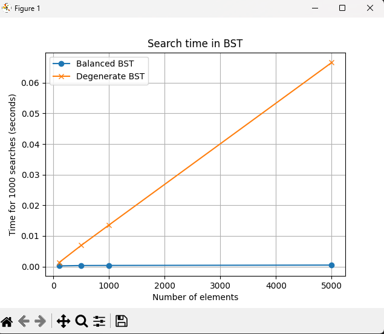
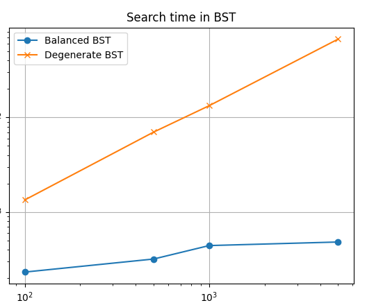

# Отчет по лабораторной работе 6
#  Деревья. Бинарные деревья поиска

**Дата:** 2025-10-06
**Семестр:** 3 курс 1 полугодие - 5 семестр
**Группа:** ПИЖ-Б_О-23-1(2)
**Дисциплина:** Анализ сложности алгоритмов
**Студент:** Проценко Дмитрий Максимович

## Цель работы
Цель работы: Изучить древовидные структуры данных, их свойства и применение. Освоить основные
операции с бинарными деревьями поиска (BST). Получить практические навыки реализации BST на
основе узлов (pointer-based), рекурсивных алгоритмов обхода и анализа их эффективности.
Исследовать влияние сбалансированности дерева на производительность операций.

## Теоретическая часть

- Дерево: Рекурсивная структура данных, состоящая из узлов, где каждый узел имеет значение и ссылки на дочерние узлы.
- Бинарное дерево поиска (BST): Дерево, для которого выполняются следующие условия:
    - Значение в левом поддереве любого узла меньше значения в самом узле.
    - Значение в правом поддереве любого узла больше значения в самом узле.
    - Оба поддерева являются бинарными деревьями поиска.
- Основные операции BST:
    - Вставка (Insert): Сложность: в среднем O(log n), в худшем (вырожденное дерево) O(n).
    - Поиск (Search): Сложность: в среднем O(log n), в худшем O(n).
    - Удаление (Delete): Сложность: в среднем O(log n), в худшем O(n). Имеет три случая: удаление листа, узла с одним потомком, узла с двумя потомками.
    - Обход (Traversal):
        - In-order (левый-корень-правый): Посещает узлы в порядке возрастания. Сложность O(n).
        - Pre-order (корень-левый-правый): Полезен для копирования структуры дерева. Сложность O(n).
        - Post-order (левый-правый-корень): Полезен для удаления дерева. Сложность O(n).
- Сбалансированные деревья: Деревья с контролем высоты (например, AVL, Красно-черные), которые гарантируют время операций O(log n) даже в худшем случае.

Для проведения тестов использовался апарат со следующими комплектующими:
Характеристики ПК для тестирования:
- Процессор: Intel Core i7-12700H @ 2.30GHz
- Оперативная память: 16 GB DDR4
- ОС: Windows 11
- Python: 3.13.1

## Практическая часть

1. Реализовать бинарное дерево поиска на основе узлов с основными операциями.
2. Реализовать различные методы обхода дерева (рекурсивные и итеративные).
3. Реализовать дополнительные методы для работы с BST.
4. Провести анализ сложности операций для сбалансированного и вырожденного деревьев.
5. Визуализировать структуру дерева.

### Ключевые фрагменты кода

~~~ python
from typing import Optional

class TreeNode:
    """Узел бинарного дерева поиска (BST)"""
    def __init__(self, value):
        self.value = value          # Значение узла
        self.left: Optional['TreeNode'] = None   # Левый потомок
        self.right: Optional['TreeNode'] = None  # Правый потомок

class BinarySearchTree:
    """Класс бинарного дерева поиска (BST)"""
    def __init__(self):
        self.root: Optional[TreeNode] = None  # Корень дерева

    def insert(self, value):
        """Вставка нового значения в BST"""
        if self.root is None:
            # Если дерево пустое, создаем корень
            self.root = TreeNode(value)
            return

        current = self.root
        while True:
            if value < current.value:
                # Идем в левое поддерево
                if current.left is None:
                    current.left = TreeNode(value)
                    return
                current = current.left
            elif value > current.value:
                # Идем в правое поддерево
                if current.right is None:
                    current.right = TreeNode(value)
                    return
                current = current.right
            else:
                # Значение уже есть — игнорируем или обновляем (в BST обычно уникальные ключи)
               return
    # Средний	O(log n) — дерево сбалансировано, высота ~ log n
    # Худший	O(n) — дерево вырождено (список)

    def search(self, value) -> Optional[TreeNode]:
        """Поиск узла с заданным значением"""
        current = self.root
        while current:
            if value < current.value:
                current = current.left
            elif value > current.value:
                current = current.right
            else:
                return current  # Найдено
        return None  # Не найдено
    # Средний	O(log n)
    # Худший	O(n)

    def find_min(self, node: Optional[TreeNode]) -> Optional[TreeNode]:
        """Поиск узла с минимальным значением в поддереве"""
        if node is None:
            return None
        current = node
        while current.left:
            current = current.left
        return current
    # Средний	O(log n)
    # Худший	O(n)

    def find_max(self, node: Optional[TreeNode]) -> Optional[TreeNode]:
        """Поиск узла с максимальным значением в поддереве"""
        if node is None:
            return None
        current = node
        while current.right:
            current = current.right
        return current
    # Средний	O(log n)
    # Худший	O(n)

    def delete(self, value):
        """Удаление узла с заданным значением"""
        self.root = self._delete_rec(self.root, value)
    # Средний	O(log n)
    # Худший	O(n)

    def _delete_rec(self, node: Optional[TreeNode], value) -> Optional[TreeNode]:
        """Рекурсивная функция удаления узла"""
        if node is None:
            return None

        if value < node.value:
            node.left = self._delete_rec(node.left, value)
        elif value > node.value:
            node.right = self._delete_rec(node.right, value)
        else:
            # Найден узел для удаления
            if node.left is None:
                return node.right  # Если нет левого потомка — возвращаем правого
            elif node.right is None:
                return node.left   # Если нет правого потомка — возвращаем левого
            else:
                # Узел имеет двух потомков — ищем минимальный элемент в правом поддереве
                min_larger_node = self.find_min(node.right)
                node.value = min_larger_node.value  # Копируем значение
                node.right = self._delete_rec(node.right, min_larger_node.value)  # Удаляем дубликат

        return node
    
    def is_valid_bst(self, node: Optional[TreeNode] = None, min_val=float('-inf'), max_val=float('inf')) -> bool:
        """Проверка корректности BST"""
        if node is None:
            node = self.root
        if node is None:
            return True  # пустое дерево корректно
        if not (min_val < node.value < max_val):
            return False
        left_valid = self.is_valid_bst(node.left, min_val, node.value) if node.left else True
        right_valid = self.is_valid_bst(node.right, node.value, max_val) if node.right else True
        return left_valid and right_valid

    def height(self, node: Optional[TreeNode] = None) -> int:
        """Вычисление высоты дерева/поддерева"""
        if node is None:
            node = self.root
        if node is None:
            return 0
        left_height = self.height(node.left) if node.left else 0
        right_height = self.height(node.right) if node.right else 0
        return 1 + max(left_height, right_height)

from typing import Optional, List
from binary_search_tree import TreeNode

class TreeTraversal:
    """Класс с методами обхода BST"""

    @staticmethod
    def inorder_recursive(node: Optional[TreeNode], result: Optional[List[int]] = None) -> List[int]:
        """In-order обход: левое поддерево → корень → правое поддерево"""
        if result is None:
            result = []
        if node:
            TreeTraversal.inorder_recursive(node.left, result)
            result.append(node.value)
            TreeTraversal.inorder_recursive(node.right, result)
        return result

    @staticmethod
    def preorder_recursive(node: Optional[TreeNode], result: Optional[List[int]] = None) -> List[int]:
        """Pre-order обход: корень → левое поддерево → правое поддерево"""
        if result is None:
            result = []
        if node:
            result.append(node.value)
            TreeTraversal.preorder_recursive(node.left, result)
            TreeTraversal.preorder_recursive(node.right, result)
        return result

    @staticmethod
    def postorder_recursive(node: Optional[TreeNode], result: Optional[List[int]] = None) -> List[int]:
        """Post-order обход: левое поддерево → правое поддерево → корень"""
        if result is None:
            result = []
        if node:
            TreeTraversal.postorder_recursive(node.left, result)
            TreeTraversal.postorder_recursive(node.right, result)
            result.append(node.value)
        return result

    @staticmethod
    def inorder_iterative(root: Optional[TreeNode]) -> List[int]:
        """Итеративный in-order обход с использованием стека"""
        result: List[int] = []
        stack: List[TreeNode] = []
        current = root

        while stack or current:
            # Спускаемся влево до самого левого узла
            while current:
                stack.append(current)
                current = current.left

            current = stack.pop()  # Берем узел из стека
            result.append(current.value)  # Обрабатываем корень
            current = current.right  # Переходим в правое поддерево

        return result

import random
import time
import matplotlib.pyplot as plt
from binary_search_tree import BinarySearchTree

def build_balanced_tree(size):
    bst = BinarySearchTree()
    values = list(range(size))
    random.shuffle(values)  # случайный порядок
    for v in values:
        bst.insert(v)
    return bst

def build_degenerate_tree(size):
    bst = BinarySearchTree()
    for v in range(size):  # отсортированный порядок
        bst.insert(v)
    return bst

def measure_search_time(bst, queries):
    start = time.perf_counter()
    for q in queries:
        bst.search(q)
    end = time.perf_counter()
    return end - start

def experiment():
    sizes = [100, 500, 1000, 5000]
    search_count = 1000

    balanced_times = []
    degenerate_times = []

    for size in sizes:
        # Сбалансированное дерево
        bst_balanced = build_balanced_tree(size)
        queries = [random.randint(0, size-1) for _ in range(search_count)]
        t_bal = measure_search_time(bst_balanced, queries)
        balanced_times.append(t_bal)

        # Вырожденное дерево
        bst_deg = build_degenerate_tree(size)
        queries = [random.randint(0, size-1) for _ in range(search_count)]
        t_deg = measure_search_time(bst_deg, queries)
        degenerate_times.append(t_deg)

        print(f"Size={size}: balanced={t_bal:.6f}s, degenerate={t_deg:.6f}s")

    return sizes, balanced_times, degenerate_times

# Построение графиков
def plot_times(sizes, balanced_times, degenerate_times):
    plt.plot(sizes, balanced_times, label="Balanced BST", marker='o')
    plt.plot(sizes, degenerate_times, label="Degenerate BST", marker='x')
    plt.xlabel("Number of elements")
    plt.ylabel("Time for 1000 searches (seconds)")
    plt.title("Search time in BST")
    plt.legend()
    plt.grid(True)
    plt.xscale('log')  # логарифмическая шкала по X
    plt.yscale('log')  # логарифмическая шкала по Y
    plt.show()

if __name__ == "__main__":
    # Эксперимент
    sizes, balanced_times, degenerate_times = experiment()

    # Визуализация дерева (пример для 10 элементов)
    print("\nExample Balanced BST with 10 elements:")
    bst_example = build_balanced_tree(10)

    # Построение графиков
    plot_times(sizes, balanced_times, degenerate_times)

import unittest
from binary_search_tree import BinarySearchTree
from tree_traversal import TreeTraversal

class TestBinarySearchTree(unittest.TestCase):
    def setUp(self):
        """Создание нового дерева для каждого теста"""
        self.bst = BinarySearchTree()

    def test_insert_and_search(self):
        """Тест вставки и поиска"""
        values = [10, 5, 15, 3, 7, 12, 18]
        for v in values:
            self.bst.insert(v)

        # Проверяем, что все вставленные элементы можно найти
        for v in values:
            node = self.bst.search(v)
            self.assertIsNotNone(node)
            self.assertEqual(node.value, v)

        # Проверяем поиск несуществующего элемента
        self.assertIsNone(self.bst.search(100))

        # Проверяем, что дерево остаётся корректным BST
        self.assertTrue(self.bst.is_valid_bst())

    def test_delete_leaf_node(self):
        """Удаление листового узла"""
        values = [10, 5, 15]
        for v in values:
            self.bst.insert(v)

        self.bst.delete(5)  # лист
        self.assertIsNone(self.bst.search(5))
        self.assertTrue(self.bst.is_valid_bst())

    def test_delete_node_with_one_child(self):
        """Удаление узла с одним потомком"""
        values = [10, 5, 15, 12]
        for v in values:
            self.bst.insert(v)

        self.bst.delete(15)  # узел с одним левым потомком
        self.assertIsNone(self.bst.search(15))
        self.assertTrue(self.bst.is_valid_bst())

    def test_delete_node_with_two_children(self):
        """Удаление узла с двумя потомками"""
        values = [10, 5, 15, 12, 18]
        for v in values:
            self.bst.insert(v)

        self.bst.delete(15)  # узел с двумя потомками
        self.assertIsNone(self.bst.search(15))
        self.assertTrue(self.bst.is_valid_bst())

    def test_inorder_traversal_sorted(self):
        """In-order traversal должен возвращать отсортированный список"""
        values = [10, 5, 15, 3, 7, 12, 18]
        for v in values:
            self.bst.insert(v)

        sorted_values = sorted(values)
        traversal_result = TreeTraversal.inorder_recursive(self.bst.root)
        self.assertEqual(traversal_result, sorted_values)

    def test_height(self):
        """Проверка высоты дерева"""
        values = [10, 5, 15, 3, 7, 12, 18]
        for v in values:
            self.bst.insert(v)

        h = self.bst.height()
        # Высота сбалансированного дерева из 7 узлов = 3
        self.assertEqual(h, 3)

if __name__ == "__main__":
    unittest.main(argv=[''], exit=False, verbosity=2)

~~~

## Результаты выполнения

### Пройденные тесты программы

test_delete_leaf_node (__main__.TestBinarySearchTree.test_delete_leaf_node)
Удаление листового узла ... ok
test_delete_node_with_one_child (__main__.TestBinarySearchTree.test_delete_node_with_one_child)
Удаление узла с одним потомком ... ok
test_delete_node_with_two_children (__main__.TestBinarySearchTree.test_delete_node_with_two_children)
Удаление узла с двумя потомками ... ok
test_height (__main__.TestBinarySearchTree.test_height)
Проверка высоты дерева ... ok
test_inorder_traversal_sorted (__main__.TestBinarySearchTree.test_inorder_traversal_sorted)
In-order traversal должен возвращать отсортированный список ... ok
test_insert_and_search (__main__.TestBinarySearchTree.test_insert_and_search)
Тест вставки и поиска ... ok

----------------------------------------------------------------------
Ran 6 tests in 0.002s

### Пример работы программы

Size=100: balanced=0.000207s, degenerate=0.001255s
Size=500: balanced=0.000336s, degenerate=0.006604s
Size=1000: balanced=0.000420s, degenerate=0.013624s
Size=5000: balanced=0.000585s, degenerate=0.067340s

## Ответы на контрольные вопросы

1. Сформулируйте основное свойство бинарного дерева поиска (BST).

Основное свойство BST:

Для любого узла N:
- Все ключи в левом поддереве N меньше ключа N.
- Все ключи в правом поддереве N больше ключа N.
- Это свойство рекурсивно выполняется для всех поддеревьев.

2. Опишите алгоритм вставки нового элемента в BST. Какова сложность этой операции в
сбалансированном и вырожденном дереве?

Алгоритм вставки:

1. Начать с корня дерева.
2. Сравнить ключ нового элемента с ключом текущего узла:
    - Если ключ меньше → идем в левое поддерево.
    - Если ключ больше → идем в правое поддерево.
3. Повторять шаг 2 рекурсивно до тех пор, пока не найдем пустое место (None) для вставки.
4. Вставить элемент в найденное место.

Сложность операции:
- Сбалансированное дерево:
    - Высота дерева h ≈ log₂(n)
    - Вставка выполняется за O(log n)
- Вырожденное дерево (например, все элементы добавляются по возрастанию):
    - Высота дерева h ≈ n
    - Вставка выполняется за O(n)

3. Чем отличается обход дерева в глубину (DFS) от обхода в ширину (BFS)? Назовите виды DFS обходов и их особенности.

- DFS (Depth-First Search / обход в глубину):
    - Сначала идем по одному пути до самого конца (до листа), потом возвращаемся и исследуем другие ветви.
    - Реализуется рекурсивно или с помощью стека.
    - Виды DFS:
        1. Pre-order (узел → левое → правое)
            - Сначала обрабатывается узел, потом поддеревья.
        2. In-order (левое → узел → правое)
            - BST дает элементы в отсортированном порядке.
        3. Post-order (левое → правое → узел)
            - Полезно для удаления дерева или вычисления выражений в деревьях выражений.
- BFS (Breadth-First Search / обход в ширину):
    - Исследует дерево по уровням: сначала корень, потом все узлы первого уровня, затем второго и т.д.
    - Реализуется с помощью очереди.

4. Почему в вырожденном BST (например, когда элементы добавляются в отсортированном
порядке) сложность операций поиска и вставки становится O(n)?

- Если элементы вставляются в отсортированном порядке, каждый новый элемент становится правым потомком предыдущего.
- Дерево превращается в список: каждый узел имеет только одного потомка.
- Высота дерева h = n.
- Поиск элемента требует прохода почти всех узлов → O(n)
- Вставка также требует спуска до конца → O(n)

5. Что такое сбалансированное дерево (например, AVL-дерево) и как оно решает проблему
вырождения BST?

- Сбалансированное дерево — это BST, в котором разница высот левого и правого поддеревьев любого узла ограничена константой.
- Пример: AVL-дерево, где разница высот поддеревьев ≤ 1.

Как решает проблему вырождения:
1. После каждой вставки или удаления проверяется баланс узлов.
2. Если баланс нарушен, выполняются ротации (левые/правые), чтобы дерево оставалось сбалансированным.
3. Высота дерева при n элементах всегда O(log n), поэтому все операции поиска, вставки и удаления выполняются O(log n) даже при добавлении отсортированных данных.