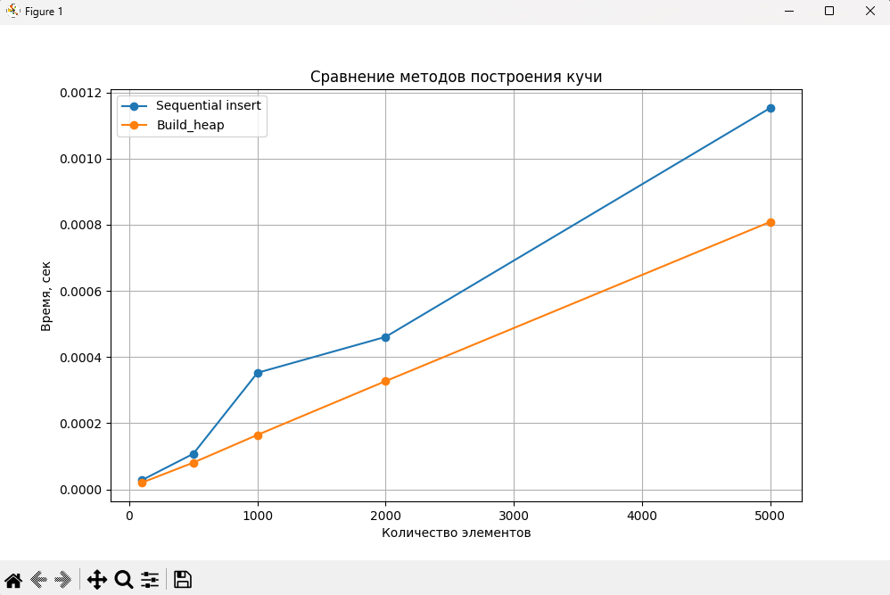
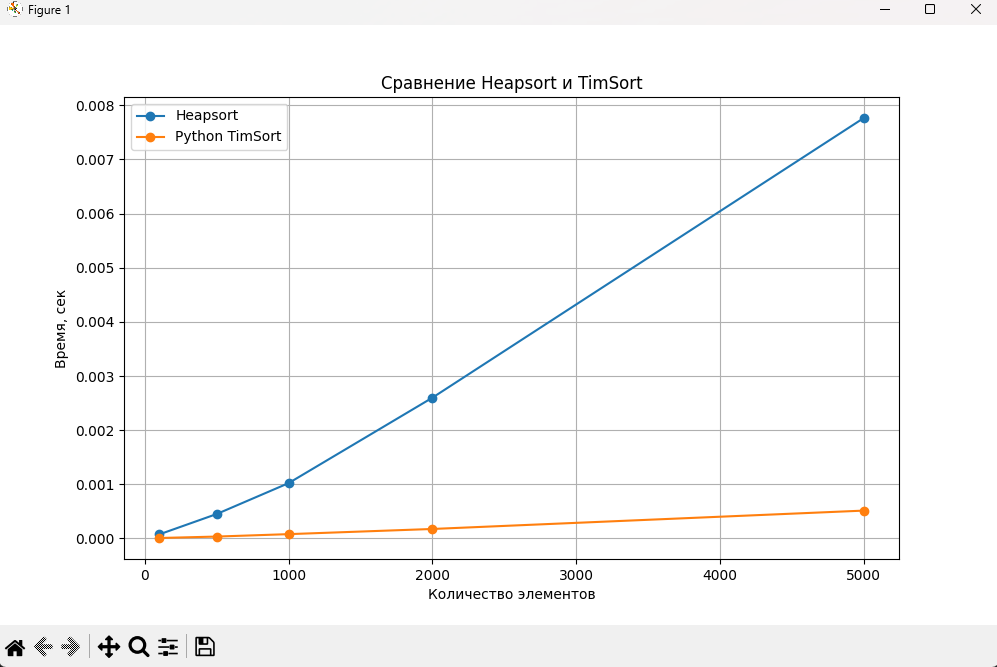

# Отчет по лабораторной работе 7
#  Кучи (Heaps)

**Дата:** 2025-10-06
**Семестр:** 3 курс 1 полугодие - 5 семестр
**Группа:** ПИЖ-Б_О-23-1(2)
**Дисциплина:** Анализ сложности алгоритмов
**Студент:** Проценко Дмитрий Максимович

## Цель работы
Цель работы: Изучить структуру данных "куча" (heap), её свойства и применение. Освоить основные
операции с кучей (добавление, извлечение корня) и алгоритм её построения. Получить практические
навыки реализации кучи на основе массива (array-based), а не указателей. Исследовать эффективность
основных операций и применение кучи для сортировки и реализации приоритетной очереди.

## Теоретическая часть

- Куча (Heap): Специализированная древовидная структура данных, удовлетворяющая свойству кучи. Является полным бинарным деревом (все уровни заполнены, кроме последнего, который заполняется слева направо).
- Свойство кучи:
    - Min-Heap: Значение в любом узле меньше или равно значениям его потомков. Корень - минимальный элемент.
    - Max-Heap: Значение в любом узле больше или равно значениям его потомков. Корень — максимальный элемент.
- Реализация: Куча эффективно реализуется на основе массива. Для узла с индексом i:
    - Индекс родителя: (i-1)//2
    - Индекс левого потомка: 2*i + 1
    - Индекс правого потомка: 2*i + 2
- Основные операции:
    - Вставка (Insert): Элемент добавляется в конец массива и "всплывает" (sift-up) до восстановления свойства кучи. Сложность: O(log n).
    - Извлечение корня (Extract): Корень (элемент [0]) извлекается, последний элемент ставится на его место и "погружается" (sift-down) до восстановления свойства кучи. Сложность: O(log n).
    - Построение кучи (Heapify): Преобразование произвольного массива в кучу. Может быть выполнено алгоритмом со сложностью O(n).
- Применение:
    - Сортировка кучей (Heapsort).
    - Реализация приоритетной очереди.
    - Алгоритм Дейкстры.

Для проведения тестов использовался апарат со следующими комплектующими:
Характеристики ПК для тестирования:
- Процессор: Intel Core i7-12700H @ 2.30GHz
- Оперативная память: 16 GB DDR4
- ОС: Windows 11
- Python: 3.13.1

## Практическая часть

1. Реализовать структуру данных "куча" (min-heap и max-heap) на основе массива.
2. Реализовать основные операции и алгоритм построения кучи из массива.
3. Реализовать алгоритм сортировки кучей (Heapsort).
4. Провести анализ сложности операций.
5. Сравнить производительность сортировки кучей с другими алгоритмами

### Ключевые фрагменты кода

~~~ python
from typing import List, Optional

class MinHeap:
    """Мин-куча на основе массива"""
    def __init__(self):
        self.heap: List[int] = []

    def _sift_up(self, index: int):
        """Всплытие элемента вверх для восстановления свойства кучи"""
        parent = (index - 1) // 2
        while index > 0 and self.heap[index] < self.heap[parent]:
            self.heap[index], self.heap[parent] = self.heap[parent], self.heap[index]
            index = parent
            parent = (index - 1) // 2
    # Временная сложность: O(log n)

    def _sift_down(self, index: int):
        """Погружение элемента вниз для восстановления свойства кучи"""
        n = len(self.heap)
        while True:
            smallest = index
            left = 2 * index + 1
            right = 2 * index + 2

            if left < n and self.heap[left] < self.heap[smallest]:
                smallest = left
            if right < n and self.heap[right] < self.heap[smallest]:
                smallest = right

            if smallest == index:
                break

            self.heap[index], self.heap[smallest] = self.heap[smallest], self.heap[index]
            index = smallest
    # Временная сложность: O(log n)

    def insert(self, value: int):
        """Вставка элемента в кучу"""
        self.heap.append(value)
        self._sift_up(len(self.heap) - 1)
    # Временная сложность: O(log n)

    def extract(self) -> Optional[int]:
        """Извлечение корня (минимального элемента)"""
        if not self.heap:
            return None
        root = self.heap[0]
        last = self.heap.pop()
        if self.heap:
            self.heap[0] = last
            self._sift_down(0)
        return root
    # Временная сложность: O(log n)

    def peek(self) -> Optional[int]:
        """Просмотр корня без удаления"""
        return self.heap[0] if self.heap else None
    # Временная сложность: O(1)

    def build_heap(self, array: List[int]):
        """Построение кучи из произвольного массива"""
        self.heap = array[:]
        n = len(self.heap)
        # Запускаем _sift_down с последних родителей до корня
        for i in range((n - 2) // 2, -1, -1):
            self._sift_down(i)
    # Временная сложность: O(n)

from typing import List
from heap import MinHeap

def heapsort(array: List[int]) -> List[int]:
    """Heapsort через отдельную MinHeap"""
    heap = MinHeap()
    for x in array:
        heap.insert(x)
    sorted_array = [heap.extract() for _ in range(len(array))]
    return sorted_array

def heapsort_in_place(array: List[int]) -> List[int]:
    """Heapsort с использованием in-place алгоритма"""
    n = len(array)
    # Построение max-кучи (heapify)
    for start in range((n - 2) // 2, -1, -1):
        _sift_down(array, start, n - 1)
    
    # Извлечение элементов из кучи
    for end in range(n - 1, 0, -1):
        array[0], array[end] = array[end], array[0]  # перемещаем максимум в конец
        _sift_down(array, 0, end - 1)
    
    return array  # массив отсортирован по возрастанию

# --- Вспомогательные функции для in-place Heapsort ---
def _sift_down(arr: List[int], start: int, end: int):
    """Погружение элемента вниз для восстановления свойства кучи"""
    root = start
    while True:
        child = 2 * root + 1  # левый потомок
        if child > end:
            break
        if child + 1 <= end and arr[child + 1] > arr[child]:
            child += 1  # выбираем больший потомок
        if arr[root] < arr[child]:
            arr[root], arr[child] = arr[child], arr[root]
            root = child
        else:
            break

from heap import MinHeap
from typing import Any

class PriorityQueue:
    """Приоритетная очередь на основе MinHeap"""
    def __init__(self):
        self._heap = MinHeap()

    def enqueue(self, item: Any, priority: int):
        """Добавление элемента с приоритетом"""
        self._heap.insert((priority, item))
        # Время: O(log n)

    def dequeue(self) -> Any:
        """Извлечение элемента с наивысшим приоритетом (минимальный приоритет)"""
        element = self._heap.extract()
        return element[1] if element else None
        # Время: O(log n)

    def peek(self) -> Any:
        """Просмотр элемента с наивысшим приоритетом"""
        element = self._heap.peek()
        return element[1] if element else None
        # Время: O(1)

import unittest
from heap import MinHeap
from heapsort import heapsort, heapsort_in_place
from priority_queue import PriorityQueue

class TestHeap(unittest.TestCase):

    def setUp(self):
        self.values = [5, 3, 8, 1, 9, 2]

    def test_min_heap_insert_extract(self):
        heap = MinHeap()
        for v in self.values:
            heap.insert(v)
        # Проверяем, что после вставки свойство кучи сохраняется
        sorted_vals = []
        while heap.peek() is not None:
            sorted_vals.append(heap.extract())
        self.assertEqual(sorted_vals, sorted(self.values))

    def test_build_heap(self):
        heap = MinHeap()
        heap.build_heap(self.values)
        sorted_vals = []
        while heap.peek() is not None:
            sorted_vals.append(heap.extract())
        self.assertEqual(sorted_vals, sorted(self.values))

    def test_heapsort(self):
        sorted_array = heapsort(self.values)
        self.assertEqual(sorted_array, sorted(self.values))

    def test_heapsort_in_place(self):
        arr = self.values[:]
        sorted_arr = heapsort_in_place(arr)
        self.assertEqual(sorted_arr, sorted(self.values))

class TestPriorityQueue(unittest.TestCase):

    def setUp(self):
        self.pq = PriorityQueue()
        self.items = [('task1', 5), ('task2', 1), ('task3', 3)]

    def test_enqueue_dequeue(self):
        for item, priority in self.items:
            self.pq.enqueue(item, priority)
        # Извлекаем элементы по приоритету (от минимального)
        extracted = [self.pq.dequeue() for _ in range(len(self.items))]
        expected_order = ['task2', 'task3', 'task1']
        self.assertEqual(extracted, expected_order)

    def test_peek(self):
        for item, priority in self.items:
            self.pq.enqueue(item, priority)
        self.assertEqual(self.pq.peek(), 'task2')  # минимальный приоритет = 1

if __name__ == "__main__":
    unittest.main(verbosity=2)

import time
import random
import matplotlib.pyplot as plt
from heap import MinHeap
from heapsort import heapsort_in_place
from typing import List

# ------------------------------
# Замеры времени построения кучи
# ------------------------------
def measure_heap_build_times(sizes):
    insert_times = []
    build_times = []

    for n in sizes:
        data = random.sample(range(n * 10), n)

        # Последовательная вставка
        heap = MinHeap()
        start = time.perf_counter()
        for x in data:
            heap.insert(x)
        t_insert = time.perf_counter() - start
        insert_times.append(t_insert)

        # Построение через build_heap
        heap2 = MinHeap()
        start = time.perf_counter()
        heap2.build_heap(data)
        t_build = time.perf_counter() - start
        build_times.append(t_build)

        print(f"[{n} элементов] Sequential insert: {t_insert:.6f}s, Build_heap: {t_build:.6f}s")

    return insert_times, build_times

# ------------------------------
# Замеры времени сортировки
# ------------------------------
def measure_sort_times(sizes):
    heapsort_times = []
    timsort_times = []
    quicksort_times = []

    for n in sizes:
        data = random.sample(range(n * 10), n)

        # Heapsort in-place
        arr = data[:]
        start = time.perf_counter()
        heapsort_in_place(arr)
        t_heap = time.perf_counter() - start
        heapsort_times.append(t_heap)

        # TimSort встроенный
        arr = data[:]
        start = time.perf_counter()
        sorted(arr)
        t_tim = time.perf_counter() - start
        timsort_times.append(t_tim)

        # QuickSort
        arr = data[:]
        start = time.perf_counter()
        quicksort(arr)
        t_qs = time.perf_counter() - start
        quicksort_times.append(t_qs)

        print(f"[{n} элементов] Heapsort: {t_heap:.6f}s, TimSort: {t_tim:.6f}s, QuickSort: {t_qs:.6f}s")

    return heapsort_times, timsort_times, quicksort_times

# ------------------------------
# Простейный QuickSort
# ------------------------------
def quicksort(arr: List[int]):
    if len(arr) <= 1:
        return arr
    pivot = arr[len(arr)//2]
    left = [x for x in arr if x < pivot]
    mid = [x for x in arr if x == pivot]
    right = [x for x in arr if x > pivot]
    arr[:] = quicksort(left) + mid + quicksort(right)
    return arr

# ------------------------------
# Текстовая визуализация MinHeap
# ------------------------------
def print_heap(heap_list, index=0, indent=0):
    if index >= len(heap_list):
        return
    right = 2 * index + 2
    left = 2 * index + 1
    print_heap(right, indent + 4)
    print(" " * indent + str(heap_list[index]))
    print_heap(left, indent + 4)

# ------------------------------
# Графическая визуализация MinHeap
# ------------------------------
def plot_heap_graph(heap_list):
    positions = {}

    def dfs(index, x, y, level=0):
        if index >= len(heap_list):
            return
        positions[index] = (x, y)
        left = 2*index + 1
        right = 2*index + 2
        offset = 1.0/(2**(level+1))
        dfs(left, x - offset, y - 1, level + 1)
        dfs(right, x + offset, y - 1, level + 1)

    dfs(0, 0.5, 0)

    plt.figure(figsize=(8,4))
    for i, (x, y) in positions.items():
        plt.scatter(x, -y, s=100)
        plt.text(x, -y, str(heap_list[i]), ha='center', va='center', color='white', fontsize=9)
        left = 2*i + 1
        right = 2*i + 2
        if left in positions:
            plt.plot([x, positions[left][0]], [-y, -positions[left][1]], 'k-')
        if right in positions:
            plt.plot([x, positions[right][0]], [-y, -positions[right][1]], 'k-')
    plt.axis('off')
    plt.show()

# ------------------------------
# Построение графиков
# ------------------------------
def plot_times(sizes, times_dict, title):
    plt.figure(figsize=(10,6))
    for label, times in times_dict.items():
        plt.plot(sizes, times, marker='o', label=label)
    plt.xlabel("Количество элементов")
    plt.ylabel("Время, сек")
    plt.title(title)
    plt.legend()
    plt.grid(True)
    plt.show()

# ------------------------------
# Главная функция
# ------------------------------
def main():
    sizes = [100, 500, 1000, 2000, 5000]

    print("\n=== Замеры времени построения кучи ===")
    insert_times, build_times = measure_heap_build_times(sizes)
    plot_times(sizes,
               {"Sequential insert": insert_times, "Build_heap": build_times},
               "Сравнение методов построения кучи")

    print("\n=== Замеры времени сортировки ===")
    heapsort_times, timsort_times, quicksort_times = measure_sort_times(sizes)
    plot_times(sizes,
               {"Heapsort": heapsort_times, "TimSort": timsort_times, "QuickSort": quicksort_times},
               "Сравнение Heapsort, TimSort и QuickSort")

if __name__ == "__main__":
    main()

~~~

## Результаты выполнения

### Пройденные тесты программы

test_build_heap (__main__.TestHeap.test_build_heap) ... ok
test_heapsort (__main__.TestHeap.test_heapsort) ... ok
test_heapsort_in_place (__main__.TestHeap.test_heapsort_in_place) ... ok
test_min_heap_insert_extract (__main__.TestHeap.test_min_heap_insert_extract) ... ok
test_enqueue_dequeue (__main__.TestPriorityQueue.test_enqueue_dequeue) ... ok
test_peek (__main__.TestPriorityQueue.test_peek) ... ok

----------------------------------------------------------------------
Ran 6 tests in 0.002s

OK

### Пример работы программы

=== Замеры времени построения кучи ===
[100 элементов] Sequential insert: 0.000029s, Build_heap: 0.000022s
[500 элементов] Sequential insert: 0.000115s, Build_heap: 0.000083s
[1000 элементов] Sequential insert: 0.000228s, Build_heap: 0.000172s
[2000 элементов] Sequential insert: 0.000456s, Build_heap: 0.000324s
[5000 элементов] Sequential insert: 0.001398s, Build_heap: 0.001125s

=== Замеры времени сортировки ===
[100 элементов] Heapsort: 0.000083s, TimSort: 0.000009s, QuickSort: 0.000125s
[500 элементов] Heapsort: 0.000460s, TimSort: 0.000036s, QuickSort: 0.000699s
[1000 элементов] Heapsort: 0.001182s, TimSort: 0.000092s, QuickSort: 0.001234s
[2000 элементов] Heapsort: 0.002699s, TimSort: 0.000218s, QuickSort: 0.002793s
[5000 элементов] Heapsort: 0.007606s, TimSort: 0.000471s, QuickSort: 0.006638s

## Ответы на контрольные вопросы

1. Сформулируйте основное свойство min-кучи и max-кучи.
    
    В min-куче каждый родитель меньше или равен потомкам, в max-куче — больше или равен, корень содержит соответственно минимальный или максимальный элемент.
2. Опишите алгоритм операции вставки нового элемента в кучу (процедуру sift_up).

    Для вставки элемента его помещают в конец кучи и "поднимают" (sift_up), меняя с родителем до выполнения свойства кучи; сложность O(log n).
3. Какова временная сложность построения кучи из произвольного массива и почему она равна
O(n), а не O(n log n)?

    Построение кучи из массива выполняется через sift_down с листьев к корню, суммарная сложность O(n), так как элементы ближе к листьям требуют меньше операций, чем элементы у корня.
4. Опишите, как работает алгоритм пирамидальной сортировки (Heapsort).
07_lab07-Кучи.md

    Heapsort строит кучу, затем многократно меняет корень с последним элементом и уменьшает размер кучи, выполняя sift_down для восстановления кучи; в итоге массив сортируется.
5. Почему кучу часто используют для реализации приоритетной очереди? Какие операции
приоритетной очереди она эффективно поддерживает?

    Кучу используют для приоритетной очереди, потому что она позволяет эффективно получать максимум/минимум и вставлять элементы с приоритетом за O(log n).