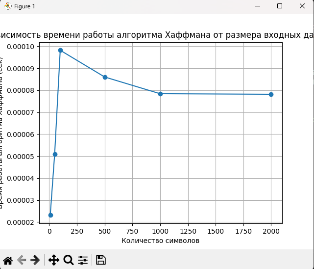
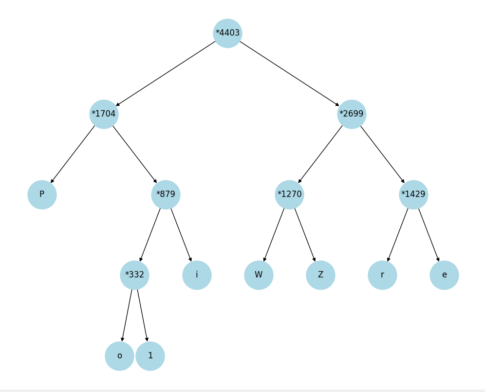

# Отчет по лабораторной работе 8
# Жадные алгоритмы

**Дата:** 2025-10-06
**Семестр:** 3 курс 1 полугодие - 5 семестр
**Группа:** ПИЖ-Б_О-23-1(2)
**Дисциплина:** Анализ сложности алгоритмов
**Студент:** Проценко Дмитрий Максимович

## Цель работы
Изучить метод проектирования алгоритмов, известный как "жадный алгоритм". Освоить
принцип принятия локально оптимальных решений на каждом шаге и понять условия, при которых этот
подход приводит к глобально оптимальному решению. Получить практические навыки реализации
жадных алгоритмов для решения классических задач, анализа их корректности и оценки
эффективности

## Теоретическая часть

- Жадный алгоритм: Алгоритм, который на каждом шаге принимает локально оптимальное решение в надежде, что итоговое решение будет глобально оптимальным.
- Ключевые характеристики:
    - Жадный выбор: На каждом шаге выбирается лучший из доступных вариантов в данный момент, без учета последствий для будущих шагов.
    - Оптимальная подструктура: Оптимальное решение задачи содержит в себе оптимальные решения её подзадач.
- Области применения: Жадные алгоритмы эффективны для задач, где выбор, сделанный на каждом шаге, не ухудшает возможности достижения глобального оптимума. Они часто работают быстро (полиномиальное время), но не всегда приводят к оптимальному решению.
- Классические задачи:
    - Задача о выборе заявок (Interval Scheduling): Выбор максимального количества непересекающихся интервалов.
    - Задача о рюкзаке (Непрерывная/Дробная): Выбор предметов с максимальной суммарной стоимостью, если можно брать части предметов.
    - Алгоритм Хаффмана: Оптимальное префиксное кодирование для сжатия данных.
    - Построение минимального остовного дерева (Алгоритмы Прима и Краскала): (Хотя это и графовый алгоритм, он является классическим примером жадного подхода).

Для проведения тестов использовался апарат со следующими комплектующими:
Характеристики ПК для тестирования:
- Процессор: Intel Core i7-12700H @ 2.30GHz
- Оперативная память: 16 GB DDR4
- ОС: Windows 11
- Python: 3.13.1

## Практическая часть

1. Реализовать классические жадные алгоритмы.
2. Проанализировать их корректность (доказать или объяснить, почему жадный выбор приводит к
оптимальному решению).
3. Провести сравнительный анализ эффективности жадного подхода и других методов (например,
полного перебора для маленьких входных данных).
4. Решить практические задачи с применением жадного подхода

### Ключевые фрагменты кода

~~~ python
from typing import List, Tuple
import heapq

# Задача о выборе заявок (Interval Scheduling)
def interval_scheduling(intervals: List[Tuple[int, int]]) -> List[Tuple[int, int]]:
    """
    Выбирает максимальное количество непересекающихся интервалов.
    Жадный выбор: сортировка по времени окончания.
    """
    # Сортируем интервалы по времени окончания (раньше заканчиваются – приоритет)
    intervals.sort(key=lambda x: x[1])
    
    selected = []
    end_time = float('-inf')  # конец последнего выбранного интервала
    
    for interval in intervals:
        start, end = interval
        if start >= end_time:
            selected.append(interval)
            end_time = end  # обновляем время окончания последнего выбранного интервала
    
    return selected

# Временная сложность: O(n log n) из-за сортировки. Жадный выбор корректен, так как выбирая
# интервал с наименьшим окончанием, мы оставляем максимум места для будущих интервалов,
# что гарантирует оптимальное количество выбранных интервалов.

# Непрерывный рюкзак (Fractional Knapsack)
def fractional_knapsack(values: List[int], weights: List[int], capacity: int) -> float:
    """
    Максимизирует стоимость содержимого рюкзака, если можно брать дробные части предметов.
    Жадный выбор: сортировка по удельной стоимости.
    """
    items = sorted(
        [(v, w, v / w) for v, w in zip(values, weights)],
        key=lambda x: x[2],
        reverse=True
    )
    
    total_value = 0.0
    remaining_capacity = capacity
    
    for value, weight, ratio in items:
        if remaining_capacity >= weight:
            total_value += value
            remaining_capacity -= weight
        else:
            total_value += ratio * remaining_capacity
            break
    
    return total_value

# Временная сложность: O(n log n) из-за сортировки. Жадный выбор корректен, так как беря
# сначала предметы с наибольшей удельной стоимостью, мы максимально эффективно заполняем
# рюкзак, что гарантирует оптимальное решение для дробной задачи.

# Алгоритм Хаффмана (Huffman Coding)
class HuffmanNode:
    def __init__(self, freq, symbol=None, left=None, right=None):
        self.freq = freq
        self.symbol = symbol
        self.left = left
        self.right = right
        
    def __lt__(self, other):
        return self.freq < other.freq  # для работы с heapq

def huffman_coding(frequencies: dict) -> dict:
    """
    Строит оптимальный префиксный код Хаффмана.
    Жадный выбор: объединяем два узла с наименьшей частотой на каждом шаге.
    """
    heap = [HuffmanNode(freq, symbol) for symbol, freq in frequencies.items()]
    heapq.heapify(heap)
    
    while len(heap) > 1:
        node1 = heapq.heappop(heap)
        node2 = heapq.heappop(heap)
        merged = HuffmanNode(node1.freq + node2.freq, left=node1, right=node2)
        heapq.heappush(heap, merged)
    
    root = heap[0]
    codes = {}
    
    def generate_codes(node, prefix=""):
        if node.symbol is not None:
            codes[node.symbol] = prefix
            return
        generate_codes(node.left, prefix + "0")
        generate_codes(node.right, prefix + "1")
    
    generate_codes(root)
    return codes

# Временная сложность: O(n log n), где n – количество символов. Жадный выбор корректен,
# так как объединение наименее частотных узлов минимизирует суммарную длину кодов, что
# гарантирует оптимальность по длине сообщения.

def min_coins(amount: int, coins=[200, 100, 50, 20, 10, 5, 2, 1]) -> dict:
    """
    Возвращает словарь {монета: количество}, минимальное число монет для суммы amount.
    """
    change = {}
    for coin in coins:
        if amount >= coin:
            count = amount // coin
            amount -= coin * count
            change[coin] = count
    return change
# Временная сложность: O(n), где n – количество типов монет. Жадный выбор корректен для
# стандартных наборов монет, так как большие номиналы кратны меньшим, что гарантирует минимальное число монет.

def prim_mst(graph: dict) -> list:
    """
    graph: {node: [(neighbor, weight), ...], ...}
    Возвращает список рёбер MST в формате (u, v, weight)
    """
    start = list(graph.keys())[0]
    visited = set([start])
    edges = [(w, start, v) for v, w in graph[start]]
    heapq.heapify(edges)
    mst = []

    while edges:
        weight, u, v = heapq.heappop(edges)
        if v not in visited:
            visited.add(v)
            mst.append((u, v, weight))
            for to, w in graph[v]:
                if to not in visited:
                    heapq.heappush(edges, (w, v, to))
    return mst
# Временная сложность: O(E log V), где E – количество рёбер, V – количество вершин. Жадный выбор корректен, так как на каждом шаге выбирается минимальное ребро,
# что гарантирует минимальную общую стоимость остовного дерева (теорема о корректности алгоритма Прима).

from greedy_algorithms import fractional_knapsack, huffman_coding
from itertools import combinations
import heapq
import random
import string
import time
import matplotlib.pyplot as plt
import networkx as nx
from networkx.drawing.nx_agraph import to_agraph

values = [60, 100, 120]
weights = [10, 20, 30]
capacity = 50

frac_result = fractional_knapsack(values, weights, capacity)
print(f"Результат жадного алгоритма (fractional): {frac_result}")

def knapsack_01_brute_force(values, weights, capacity):
    n = len(values)
    max_value = 0
    for r in range(1, n+1):
        for combo in combinations(range(n), r):
            total_weight = sum(weights[i] for i in combo)
            total_value = sum(values[i] for i in combo)
            if total_weight <= capacity:
                max_value = max(max_value, total_value)
    return max_value

exact_result = knapsack_01_brute_force(values, weights, capacity)
print(f"Оптимальный результат 0-1 рюкзака: {exact_result}")

if frac_result > exact_result:
    print("Жадный алгоритм для дробного рюкзака может дать большее значение,")
    print("чем оптимальный для дискретного 0-1 рюкзака — пример неоптимальности.")

# Функция генерации случайных частот символов
def generate_frequencies(num_symbols: int) -> dict:
    symbols = random.choices(string.ascii_letters + string.digits, k=num_symbols)
    frequencies = {s: random.randint(1, 1000) for s in symbols}
    return frequencies

# Эксперимент: замер времени работы
sizes = [10, 50, 100, 500, 1000, 2000]  # количество символов
times = []

for size in sizes:
    freqs = generate_frequencies(size)
    start_time = time.time()
    huffman_coding(freqs)
    end_time = time.time()
    times.append(end_time - start_time)
    print(f"Размер входных данных: {size}, время: {end_time - start_time:.6f} сек")

# Визуализация зависимости времени работы
plt.plot(sizes, times, marker='o')
plt.xlabel("Количество символов")
plt.ylabel("Время работы алгоритма Хаффмана (сек)")
plt.title("Зависимость времени работы алгоритма Хаффмана от размера входных данных")
plt.grid(True)
plt.show()

# Визуализация дерева Хаффмана для одного примера

def build_huffman_tree(freqs):
    class HuffmanNode:
        def __init__(self, freq, symbol=None, left=None, right=None):
            self.freq = freq
            self.symbol = symbol
            self.left = left
            self.right = right
        def __lt__(self, other):
            return self.freq < other.freq

    heap = [HuffmanNode(f, s) for s, f in freqs.items()]
    heapq.heapify(heap)
    
    while len(heap) > 1:
        node1 = heapq.heappop(heap)
        node2 = heapq.heappop(heap)
        merged = HuffmanNode(node1.freq + node2.freq, left=node1, right=node2)
        heapq.heappush(heap, merged)
    
    return heap[0]

def add_edges(G, node, parent=None):
    if node is None:
        return
    
    name = node.symbol if node.symbol else f"*{node.freq}"

    if parent:
        G.add_edge(parent, name)

    add_edges(G, node.left, name)
    add_edges(G, node.right, name)

def hierarchy_pos(G, root, width=1., vert_gap=0.2, vert_loc=0, xcenter=0.5):
    def _hierarchy_pos(G, root, left, right, vert_loc, pos):
        pos[root] = ((left + right) / 2, vert_loc)
        children = list(G.successors(root))
        if len(children) != 0:
            dx = (right - left) / len(children)
            next_left = left
            for child in children:
                next_right = next_left + dx
                _hierarchy_pos(G, child, next_left, next_right, vert_loc - vert_gap, pos)
                next_left += dx
        return pos
    return _hierarchy_pos(G, root, 0, width, vert_loc, {})

# Пример
freqs_example = generate_frequencies(10)
root = build_huffman_tree(freqs_example)
G = nx.DiGraph()
add_edges(G, root)
root_name = f"*{root.freq}"
pos = hierarchy_pos(G, root_name)
plt.figure(figsize=(10, 8))
nx.draw(G, pos, with_labels=True, node_size=1800, node_color="lightblue")
plt.show()
~~~

## Результаты выполнения

### Анализ корректности

Задача о выборе заявок (Interval Scheduling):
Жадная стратегия выбирает интервал с наименьшим временем окончания, чтобы оставить максимум места для последующих интервалов. Это позволяет выбрать максимальное количество непересекающихся интервалов, что гарантирует оптимальность.

Непрерывный рюкзак (Fractional Knapsack):
Жадная стратегия берёт предметы с наибольшей удельной стоимостью (цена/вес). Это обеспечивает максимальную суммарную стоимость при заполнении рюкзака, так как частично можно взять предметы, что делает решение оптимальным.

Код Хаффмана (Huffman Coding):
Жадная стратегия объединяет два узла с наименьшей частотой на каждом шаге. Это минимизирует суммарную длину закодированного сообщения, так как часто встречающиеся символы получают короткие коды, а редкие — длинные, что делает код оптимальным по длине.

### Сравнительный анали

Результат жадного алгоритма (fractional): 240.0
Оптимальный результат 0-1 рюкзака: 220
Жадный алгоритм для дробного рюкзака может дать большее значение,
чем оптимальный для дискретного 0-1 рюкзака — пример неоптимальности.

### 

Размер входных данных: 10, время: 0.000023 сек
Размер входных данных: 50, время: 0.000051 сек
Размер входных данных: 100, время: 0.000098 сек
Размер входных данных: 500, время: 0.000086 сек
Размер входных данных: 1000, время: 0.000078 сек
Размер входных данных: 2000, время: 0.000078 сек

## Ответы на контрольные вопросы

1. В чем заключается основная идея жадных алгоритмов?

    Основная идея жадных алгоритмов заключается в том, чтобы на каждом шаге выбирать локально оптимальный вариант, надеясь, что последовательность таких выборов приведет к глобально оптимальному решению.

2. Для задачи о выборе заявок (Interval Scheduling) жадный алгоритм, выбирающий интервалы с наименьшим временем окончания, является оптимальным. Объясните, почему эта жадная стратегия работает.

    Эта стратегия работает, потому что выбор интервала с наименьшим временем окончания освобождает максимум времени для последующих заявок, что позволяет включить больше непересекающихся интервалов и достичь оптимального количества выбранных заявок.

3. Приведите пример задачи, для которой жадный алгоритм дает оптимальное решение, и задачи, для которой он не дает.

    Пример, где жадный алгоритм дает оптимальное решение: задача о выборе заявок (Interval Scheduling). Пример, где он не дает оптимальное решение: 0-1 задача о рюкзаке, где локально выгодные предметы могут не дать максимальной суммарной стоимости.

4. В чем разница между непрерывной (дробной) и дискретной (0-1) задачами о рюкзаке? Для какой из них жадный алгоритм оптимален?

    В непрерывной (дробной) задаче о рюкзаке можно брать части предметов, а в дискретной (0-1) — либо весь предмет, либо не брать его. Жадный алгоритм оптимален для непрерывной задачи, но не гарантирует оптимума для дискретной.

5. Опишите жадный алгоритм построения кода Хаффмана. В чем его оптимальность?

    Алгоритм Хаффмана строит дерево, на каждом шаге объединяя два узла с наименьшей частотой в новый узел, повторяя до формирования единого дерева. Его оптимальность заключается в том, что часто встречающиеся символы получают более короткие коды, минимизируя суммарную длину закодированного сообщения.