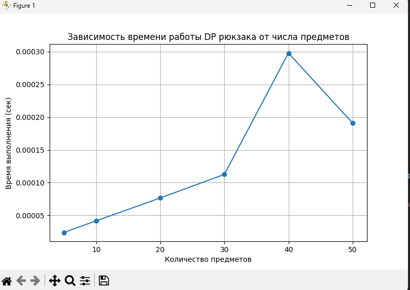

# Отчет по лабораторной работе 9
# Динамическое программирование

**Дата:** 2025-10-06
**Семестр:** 3 курс 1 полугодие - 5 семестр
**Группа:** ПИЖ-Б_О-23-1(2)
**Дисциплина:** Анализ сложности алгоритмов
**Студент:** Проценко Дмитрий Максимович

## Цель работы
Изучить метод динамического программирования (ДП) как мощный инструмент для
решения сложных задач путём их разбиения на перекрывающиеся подзадачи. Освоить два основных
подхода к реализации ДП: нисходящий (с мемоизацией) и восходящий (с заполнением таблицы).
Получить практические навыки выявления оптимальной подструктуры задач, построения таблиц ДП и
анализа временной и пространственной сложности алгоритмов.

## Теоретическая часть

- Динамическое программирование (ДП): Метод решения задач, в которых оптимальное решение всей задачи зависит от оптимальных решений её перекрывающихся подзадач.
- Ключевые принципы:
    - Оптимальная подструктура: Оптимальное решение задачи может быть построено из оптимальных решений её подзадач.
    - Перекрывающиеся подзадачи: Подзадачи, решения которых используются многократно, а не один раз.
- Подходы к реализации:
    - Нисходящее ДП (Top-Down, с мемоизацией): Рекурсивное решение с сохранением (кэшированием) результатов решения подзадач для повторных вычислений.
    - Восходящее ДП (Bottom-Up, табличное): Итеративное решение, при котором подзадачи решаются от простейших к сложным, а их результаты заносятся в таблицу (массив).
- Области применения: Задачи оптимизации, подсчёта количества способов, нахождения наиболее вероятной последовательности.
- Классические задачи:
    - Числа Фибоначчи: Классический пример перекрывающихся подзадач.
    - Задача о рюкзаке (0-1 Knapsack): Выбор предметов с максимальной суммарной стоимостью без дробления.
    - Наибольшая общая подпоследовательность (LCS): Поиск самой длинной последовательности символов, которая является подпоследовательностью двух строк.
    - Расстояние Левенштейна (Редакционное расстояние): Минимальное количество операций вставки, удаления и замены символа, необходимых для превращения одной строки в другую

Для проведения тестов использовался апарат со следующими комплектующими:
Характеристики ПК для тестирования:
- Процессор: Intel Core i7-12700H @ 2.30GHz
- Оперативная память: 16 GB DDR4
- ОС: Windows 11
- Python: 3.13.1

## Практическая часть

1. Реализовать классические алгоритмы динамического программирования.
2. Реализовать оба подхода (нисходящий и восходящий) для решения задач.
3. Провести сравнительный анализ эффективности двух подходов.
4. Проанализировать временную и пространственную сложность алгоритмов.
5. Решить практические задачи с применением ДП.

### Ключевые фрагменты кода

~~~ python
def fib_naive(n):
    # Базовые случаи: F(0)=0, F(1)=1
    if n <= 1:
        return n
    # Рекурсивное определение F(n)
    return fib_naive(n - 1) + fib_naive(n - 2)
# Время: O(2^n)
# Память: O(n) — глубина рекурсии

def fib_memo(n, memo=None):
    if memo is None:
        memo = {}

    if n <= 1:
        return n

    # Если значение уже вычислялось — вернуть из memo
    if n in memo:
        return memo[n]

    # Сохраняем результат, чтобы не вычислять повторно
    memo[n] = fib_memo(n - 1, memo) + fib_memo(n - 2, memo)
    return memo[n]
# Время: O(n)
# Память: O(n) для словаря memo + глубины рекурсии

def fib_iter(n):
    if n <= 1:
        return n

    # Создаём таблицу dp[0..n]
    dp = [0] * (n + 1)
    dp[1] = 1

    # Заполняем таблицу снизу вверх
    for i in range(2, n + 1):
        dp[i] = dp[i - 1] + dp[i - 2]

    return dp[n]
# Время: O(n)
# Память: O(n) (можно уменьшить до O(1))

def knapsack(weights, values, capacity):
    n = len(weights)

    # dp[i][w] — максимум ценности, если берем первые i предметов и рюкзак имеет вместимость w
    dp = [[0] * (capacity + 1) for _ in range(n + 1)]

    # Заполняем таблицу
    for i in range(1, n + 1):
        w = weights[i - 1]  # вес текущего предмета
        v = values[i - 1]   # ценность текущего предмета

        for cap in range(1, capacity + 1):

            if w > cap:
                # Не можем взять предмет — просто копируем значение сверху
                dp[i][cap] = dp[i - 1][cap]
            else:
                # Максимум между игнорированием и включением предмета
                dp[i][cap] = max(
                    dp[i - 1][cap],            # не берем предмет
                    dp[i - 1][cap - w] + v     # берем предмет
                )

    return dp[n][capacity]
# Время: O(n * W)
# Память: O(n * W)

def lcs(a, b):
    n, m = len(a), len(b)

    # dp[i][j] — длина LCS для a[:i] и b[:j]
    dp = [[0] * (m + 1) for _ in range(n + 1)]

    # Заполняем таблицу
    for i in range(1, n + 1):
        for j in range(1, m + 1):

            if a[i - 1] == b[j - 1]:
                # Символы совпадают → увеличиваем LCS на 1
                dp[i][j] = dp[i - 1][j - 1] + 1
            else:
                # Иначе берём максимум из верхнего и левого
                dp[i][j] = max(dp[i - 1][j], dp[i][j - 1])

    return dp[n][m]
# Время: O(n * m)
# Память: O(n * m)

def levenshtein(a, b):
    n, m = len(a), len(b)

    # dp[i][j] — минимальная стоимость преобразования первых i символов a в первые j символов b
    dp = [[0] * (m + 1) for _ in range(n + 1)]

    # Если строка пустая — стоимость равна количеству вставок/удалений
    for i in range(n + 1):
        dp[i][0] = i
    for j in range(m + 1):
        dp[0][j] = j

    # Заполняем таблицу
    for i in range(1, n + 1):
        for j in range(1, m + 1):

            if a[i - 1] == b[j - 1]:
                # Если символы равны — стоимость не увеличивается
                dp[i][j] = dp[i - 1][j - 1]
            else:
                # Выбираем минимальную операцию: удаление, вставка или замена
                dp[i][j] = 1 + min(
                    dp[i - 1][j],    # удаление
                    dp[i][j - 1],    # вставка
                    dp[i - 1][j - 1] # замена
                )

    return dp[n][m]
# Время: O(n * m)
# Память: O(n * m)

def lcs_with_reconstruction(a, b):
    n, m = len(a), len(b)

    # Строим DP-таблицу
    dp = [[0] * (m + 1) for _ in range(n + 1)]

    for i in range(1, n + 1):
        for j in range(1, m + 1):
            if a[i - 1] == b[j - 1]:
                dp[i][j] = dp[i - 1][j - 1] + 1
            else:
                dp[i][j] = max(dp[i - 1][j], dp[i][j - 1])

    # Теперь восстанавливаем LCS
    i, j = n, m
    lcs_str = []

    while i > 0 and j > 0:
        # Если символы совпадают - добавляем в ответ
        if a[i - 1] == b[j - 1]:
            lcs_str.append(a[i - 1])
            i -= 1
            j -= 1
        else:
            # Идем туда, где больше значение
            if dp[i - 1][j] >= dp[i][j - 1]:
                i -= 1
            else:
                j -= 1

    # Разворачиваем, так как восстанавливали с конца
    lcs_str.reverse()

    return dp[n][m], "".join(lcs_str)

def knapsack_with_items(weights, values, capacity):
    n = len(weights)

    # Формируем DP-таблицу
    dp = [[0] * (capacity + 1) for _ in range(n + 1)]

    for i in range(1, n + 1):
        w = weights[i - 1]
        v = values[i - 1]

        for cap in range(1, capacity + 1):
            if w > cap:
                dp[i][cap] = dp[i - 1][cap]
            else:
                dp[i][cap] = max(
                    dp[i - 1][cap],
                    dp[i - 1][cap - w] + v
                )

    # Восстановление предметов
    result_value = dp[n][capacity]
    items = []

    cap = capacity
    i = n

    while i > 0:
        # Если значение отличается от верхней строки — предмет был взят
        if dp[i][cap] != dp[i - 1][cap]:
            items.append(i - 1)  # сохраняем индекс предмета
            cap -= weights[i - 1]
        i -= 1

    items.reverse()
    return result_value, items

def coin_change_min_coins(coins, target_sum):
    """
    Возвращает минимальное количество монет для суммы target_sum.
    Если сумму собрать нельзя — возвращает -1.

    coins: список номиналов монет
    target_sum: целевая сумма
    """

    # dp[x] хранит минимальное количество монет для суммы x
    # Инициализируем "бесконечностью" — большое число,
    # чтобы можно было искать минимум.
    dp = [float('inf')] * (target_sum + 1)

    # Сумма 0 набирается нулём монет
    dp[0] = 0

    # Перебираем каждую сумму от 1 до target_sum
    for s in range(1, target_sum + 1):

        # Пробуем взять каждую монету
        for coin in coins:
            if s - coin >= 0:
                dp[s] = min(dp[s], dp[s - coin] + 1)

    # Если dp[target_sum] осталось бесконечностью — сумма недостижима
    return dp[target_sum] if dp[target_sum] != float('inf') else -1

def lis_dp(arr):
    """
    Вычисляет длину LIS (наибольшей возрастающей подпоследовательности)
    с помощью классического динамического программирования O(n²).

    arr: входная последовательность чисел
    """

    n = len(arr)
    if n == 0:
        return 0

    # dp[i] — длина LIS, заканчивающейся в позиции i
    dp = [1] * n  # минимальная LIS состоит хотя бы из одного элемента

    # Перебираем каждый элемент как потенциальный конец подпоследовательности
    for i in range(n):

        # Перебираем все предыдущие элементы j < i
        for j in range(i):
            # Если arr[j] < arr[i], то arr[i] можно добавить после arr[j]
            if arr[j] < arr[i]:
                # Обновляем dp[i] — берем максимум из всех вариантов
                dp[i] = max(dp[i], dp[j] + 1)

    # Ответ — максимальное значение dp
    return max(dp)

import time
import tracemalloc
from dynamic_programming import fib_memo, fib_iter, knapsack

def measure(func, *args):
    """Измеряем время и потребление памяти функцией func."""
    tracemalloc.start()
    start = time.perf_counter()

    result = func(*args)

    elapsed = time.perf_counter() - start
    current, peak = tracemalloc.get_traced_memory()
    tracemalloc.stop()

    return result, elapsed, peak

def compare_fibonacci(n=35):
    print("=== Сравнение Top-Down (мемоизация) и Bottom-Up ===")
    print(f"n = {n}")

    res_memo, time_memo, mem_memo = measure(fib_memo, n)
    res_iter, time_iter, mem_iter = measure(fib_iter, n)

    print("\nTop-Down (мемоизация):")
    print(f"  Значение:        {res_memo}")
    print(f"  Время:           {time_memo:.6f} сек")
    print(f"  Память (пик):    {mem_memo / 1024:.2f} КБ")

    print("\nBottom-Up (итеративный):")
    print(f"  Значение:        {res_iter}")
    print(f"  Время:           {time_iter:.6f} сек")
    print(f"  Память (пик):    {mem_iter / 1024:.2f} КБ")

    print("\nВывод:")
    print("  Bottom-Up обычно быстрее и использует меньше памяти.")
    print("  Top-Down удобнее в реализации, но вызывает накладные расходы.")

def fractional_knapsack(weights, values, capacity):
    """Реализует жадный алгоритм для непрерывного рюкзака."""
    items = list(zip(weights, values))
    # сортировка по убыванию value/weight
    items.sort(key=lambda x: x[1] / x[0], reverse=True)

    total_value = 0
    remaining = capacity

    for w, v in items:
        if w <= remaining:
            # берём весь предмет
            total_value += v
            remaining -= w
        else:
            # берём дробь предмета
            total_value += v * (remaining / w)
            break

    return total_value

def compare_knapsack():
    print("\n=== Сравнение жадного fractional и ДП для 0-1 knapsack ===")

    weights = [10, 20, 30]
    values = [60, 100, 120]
    capacity = 50

    dp_result = knapsack(weights, values, capacity)
    greedy_result = fractional_knapsack(weights, values, capacity)

    print(f"\nВес: {weights}")
    print(f"Ценность: {values}")
    print(f"Вместимость: {capacity}")

    print("\nЖадный fractional knapsack:")
    print(f"  Результат: {greedy_result}")

    print("\nДП для 0-1 knapsack:")
    print(f"  Результат: {dp_result}")

    print("\nВывод:")
    print("  Жадный алгоритм работает ТОЛЬКО для непрерывного рюкзака.")
    print("  Для 0-1 рюкзака он может дать НЕ оптимальное решение.")
    print("  Динамическое программирование всегда гарантирует оптимальный результат.")

if __name__ == "__main__":
    compare_fibonacci(35)
    compare_knapsack()

import time
import matplotlib.pyplot as plt
from dynamic_programming import knapsack

def knapsack_visual(weights, values, capacity):
    n = len(weights)
    dp = [[0] * (capacity + 1) for _ in range(n + 1)]

    for i in range(1, n + 1):
        w = weights[i - 1]
        v = values[i - 1]

        for cap in range(1, capacity + 1):
            if w > cap:
                dp[i][cap] = dp[i - 1][cap]
            else:
                dp[i][cap] = max(dp[i - 1][cap], dp[i - 1][cap - w] + v)

    # Вывод таблицы после заполнения
    print("DP-таблица (каждая строка — предмет, каждая колонка — вместимость):")
    for row in dp:
        print(row)

    return dp[n][capacity]

def knapsack_scalability_test():
    import random

    print("\n=== Экспериментальное исследование масштабируемости 0-1 рюкзака ===")
    
    # Параметры эксперимента
    item_counts = [5, 10, 20, 30, 40, 50]  # количество предметов
    capacity = 50
    times = []

    for n in item_counts:
        weights = [random.randint(1, 10) for _ in range(n)]
        values = [random.randint(10, 100) for _ in range(n)]

        start = time.perf_counter()
        knapsack(weights, values, capacity)
        elapsed = time.perf_counter() - start

        print(f"n = {n}, время = {elapsed:.6f} сек")
        times.append(elapsed)

    # Построение графика зависимости времени от числа предметов
    plt.figure(figsize=(8,5))
    plt.plot(item_counts, times, marker='o')
    plt.title("Зависимость времени работы DP рюкзака от числа предметов")
    plt.xlabel("Количество предметов")
    plt.ylabel("Время выполнения (сек)")
    plt.grid(True)
    plt.show()

if __name__ == "__main__":

    # Визуализация DP-таблицы для маленького примера
    weights = [10, 20, 30]
    values = [60, 100, 120]
    capacity = 50

    print("=== Визуализация DP-таблицы ===")
    result = knapsack_visual(weights, values, capacity)
    print(f"Максимальная ценность: {result}")

    # Исследование масштабируемости
    knapsack_scalability_test()

~~~

## Результаты выполнения

### Результаты выполнения программы

=== Сравнение Top-Down (мемоизация) и Bottom-Up ===
n = 35

Top-Down (мемоизация):
  Значение:        9227465
  Время:           0.000044 сек
  Память (пик):    1.95 КБ

Bottom-Up (итеративный):
  Значение:        9227465
  Время:           0.000024 сек
  Память (пик):    1.00 КБ

Вывод:
  Bottom-Up обычно быстрее и использует меньше памяти.
  Top-Down удобнее в реализации, но вызывает накладные расходы.

=== Сравнение жадного fractional и ДП для 0-1 knapsack ===

Вес: [10, 20, 30]
Ценность: [60, 100, 120]
Вместимость: 50

Жадный fractional knapsack:
  Результат: 240.0

ДП для 0-1 knapsack:
  Результат: 220

Вывод:
  Жадный алгоритм работает ТОЛЬКО для непрерывного рюкзака.
  Для 0-1 рюкзака он может дать НЕ оптимальное решение.
  Динамическое программирование всегда гарантирует оптимальный результат.

=== Визуализация DP-таблицы ===
DP-таблица (каждая строка — предмет, каждая колонка — вместимость):
[0, 0, 0, 0, 0, 0, 0, 0, 0, 0, 0, 0, 0, 0, 0, 0, 0, 0, 0, 0, 0, 0, 0, 0, 0, 0, 0, 0, 0, 0, 0, 0, 0, 0, 0, 0, 0, 0, 0, 0, 0, 0, 0, 0, 0, 0, 0, 0, 0, 0, 0]
[0, 0, 0, 0, 0, 0, 0, 0, 0, 0, 60, 60, 60, 60, 60, 60, 60, 60, 60, 60, 60, 60, 60, 60, 60, 60, 60, 60, 60, 60, 60, 60, 60, 60, 60, 60, 60, 60, 60, 60, 60, 60, 60, 60, 60, 60, 60, 60, 60, 60, 60]
[0, 0, 0, 0, 0, 0, 0, 0, 0, 0, 60, 60, 60, 60, 60, 60, 60, 60, 60, 60, 100, 100, 100, 100, 100, 100, 100, 100, 100, 100, 160, 160, 160, 160, 160, 160, 160, 160, 160, 160, 160, 160, 160, 160, 160, 160, 160, 160, 160, 160, 160]
[0, 0, 0, 0, 0, 0, 0, 0, 0, 0, 60, 60, 60, 60, 60, 60, 60, 60, 60, 60, 100, 100, 100, 100, 100, 100, 100, 100, 100, 100, 160, 160, 160, 160, 160, 160, 160, 160, 160, 160, 180, 180, 180, 180, 180, 180, 180, 180, 180, 180, 220]
Максимальная ценность: 220

=== Экспериментальное исследование масштабируемости 0-1 рюкзака ===
n = 5, время = 0.000024 сек
n = 10, время = 0.000042 сек
n = 20, время = 0.000077 сек
n = 30, время = 0.000113 сек
n = 40, время = 0.000298 сек
n = 50, время = 0.000191 сек

  

## Ответы на контрольные вопросы

1. Какие два основных свойства задачи указывают на то, что для ее решения можно применить динамическое программирование?

    Задача должна обладать оптимальной подструктурой (оптимальное решение складывается из оптимальных решений подзадач). Также должна присутствовать перекрываемость подзадач — одни и те же подпроблемы возникают многократно.

2. В чем разница между нисходящим (top-down) и восходящим (bottom-up) подходами в динамическом программировании?

    В нисходящем подходе мы рекурсивно решаем задачу и кэшируем результаты подзадач по мере их появления. В восходящем подходе мы заранее заполняем таблицу снизу вверх, начиная с самых маленьких подзадач.

3. Как задача о рюкзаке 0-1 демонстрирует свойство оптимальной подструктуры?

    Оптимальное решение зависит от того, включим ли мы текущий предмет, и в обоих случаях оно основывается на оптимальных решениях для меньших емкостей и меньших наборов предметов. То есть выбор лучшего варианта опирается на решения подзадач, которые сами являются оптимальными.

4. Опишите, как строится и заполняется таблица для решения задачи о наибольшей общей подпоследовательности (LCS).

    Строится матрица размером (𝑛 + 1) × (𝑚 + 1), где 𝑛 и 𝑚 — длины строк; первая строка и первый столбец заполняются нулями. Затем таблица заполняется построчно: если символы совпадают, ячейка равна значению по диагонали плюс один, иначе берется максимум из левой и верхней ячейки; в конце правый нижний угол содержит длину LCS.

5. Как с помощью динамического программирования можно уменьшить сложность вычисления чисел Фибоначчи с экспоненциальной до линейной или даже до O(log n)?

    При использовании мемоизации или итеративного заполнения массива каждый номер Фибоначчи вычисляется один раз, что дает линейную сложность O(n).
    При применении матричного возведения в степень с быстрым возведением в степень сложность уменьшается до 
    O(logn).